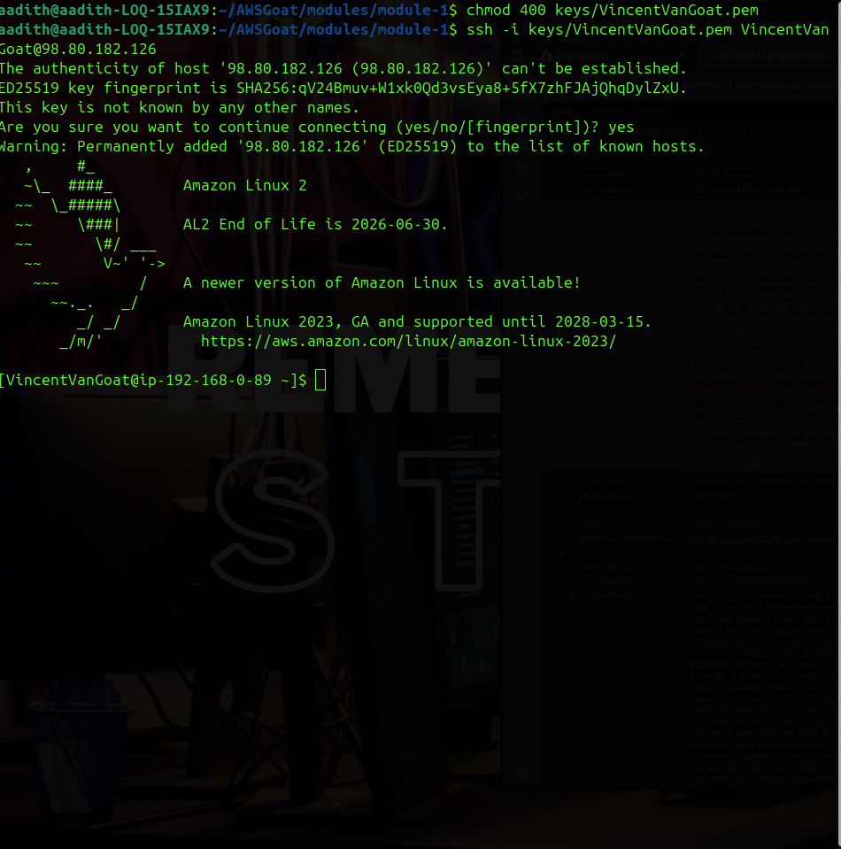
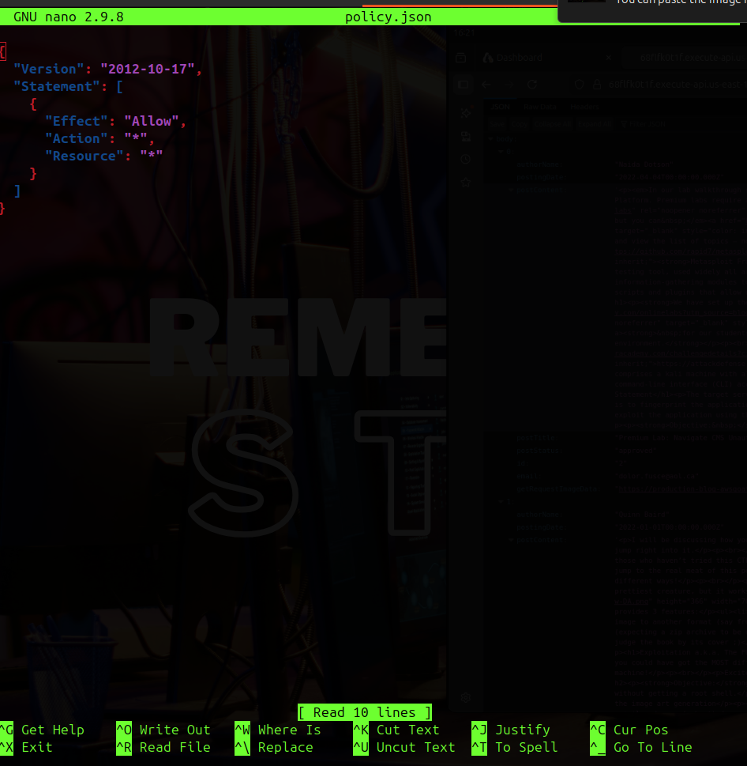

# Penetration Testing Report

## AWS Goat Vulnerable Infrastructure Assessment (With Root Cause Analysis)

**Author:** Aadith C H\
**Date:** 2026-02-25\
**Environment:** AWS Goat (Terraform Deployment)

------------------------------------------------------------------------

## 1. Introduction

AWS Goat was deployed using Terraform and AWS CLI. After successful
`terraform apply`, the application endpoint was generated and the
infrastructure was accessible for testing.

AWS Goat is a deliberately vulnerable AWS environment designed to
simulate real-world cloud misconfigurations and application
vulnerabilities.

### Vulnerabilities Assessed:

-   Cross Site Scripting (XSS)
-   SQL Injection
-   Insecure Direct Object Reference (IDOR)
-   Server Side Request Forgery (SSRF)
-   Sensitive Data Exposure
-   S3 Misconfiguration
-   IAM Privilege Escalation

------------------------------------------------------------------------

# 2. Cross Site Scripting (XSS)

The search functionality within the application reflects user-supplied
input directly into the response without proper sanitization or
encoding.

The following payload was used to test for reflected XSS:

``` html
<script>alert(1)</script>
```

Upon submission, the JavaScript executed successfully in the browser
context, triggering an alert dialog. This confirms the presence of a
**Reflected Cross-Site Scripting (XSS)** vulnerability.


------------------------------------------------------------------------

## Technical Explanation

Reflected XSS occurs when:

1.  User input is sent to the server.
2.  The server includes that input in the HTTP response.
3.  The browser renders it as executable JavaScript.

In this case:

-   The application did not sanitize `<script>` tags.
-   The payload was rendered directly into the DOM.
-   The browser executed the injected script.

------------------------------------------------------------------------

## Impact

-   Session hijacking (via cookie theft)
-   Credential harvesting
-   Malicious JavaScript injection
-   DOM manipulation
-   Redirection to phishing sites
-   Potential chaining with other vulnerabilities

Although the demonstrated payload only displayed an alert box, a real
attacker could inject malicious scripts to steal session tokens or
impersonate users.

------------------------------------------------------------------------

## Root Cause

-   No server-side input validation
-   No output encoding before rendering user input
-   Missing Content Security Policy (CSP)
-   Lack of input sanitization mechanisms
-   No security testing for client-side injection vectors

## Mitigation

-   Implement strict server-side input validation.
-   Encode all user-supplied data before rendering it in    HTML responses.
-   Use output encoding libraries to prevent script execution.
-   Implement a strong Content Security Policy (CSP).
-   Use modern frontend frameworks that auto-escape output.
-   Conduct regular security testing for client-side vulnerabilities.
-   Deploy a Web Application Firewall (WAF) to filter malicious
    payloads.

------------------------------------------------------------------------

# 3. Insecure Direct Object Reference (IDOR)

During testing of the profile functionality, Burp Suite was used to
intercept HTTP requests sent to the backend API.

Analysis of the password change request revealed that the API relied
solely on a user-supplied `id` parameter to identify which account's
password should be updated.

No verification was performed to ensure that the authenticated user
actually owned the account associated with the supplied ID.

By modifying the `id` parameter in the intercepted request, it was
possible to change the password of another user account.


After manipulating the identifier and forwarding the request, the
password of a different user was successfully changed.


------------------------------------------------------------------------

## Technical Explanation

An Insecure Direct Object Reference (IDOR) vulnerability occurs when:

1.  An application exposes a direct reference to an internal object
    (such as a user ID).
2.  Access control checks are not properly enforced.
3.  The backend trusts client-supplied identifiers.

In this case:

-   The password update endpoint accepted a user ID parameter.
-   The backend did not validate ownership of the resource.
-   The JWT/session identity was not properly matched against the
    requested user ID.
-   No authorization middleware prevented cross-user modification.

This allowed horizontal privilege escalation (user-to-user compromise).

------------------------------------------------------------------------

## Impact

-   Account takeover\
-   Unauthorized password reset\
-   Privilege abuse\
-   Lateral movement between user accounts\
-   Potential administrative account compromise

If exploited against a privileged user account, this vulnerability could
lead to full application control.

------------------------------------------------------------------------

## Root Cause

-   No authorization check linking JWT identity to resource ID\
-   Backend trusting client-supplied identifiers\
-   Missing access control validation\
-   Absence of object-level access control enforcement\
-   Lack of role-based access control (RBAC) validation

## Mitigation

-   Enforce proper authorization checks on every request.
-   Validate that the authenticated user owns or is authorized to access
    the requested resource.
-   Avoid trusting client-supplied object identifiers.
-   Implement role-based access control (RBAC).
-   Use indirect references (UUIDs) instead of predictable numeric IDs.
-   Implement centralized authorization middleware.

------------------------------------------------------------------------

# 4. SQL Injection

During testing of the user search functionality, it was observed that
user input was sent directly to the backend database without proper
sanitization.

The following payload was used to test for SQL Injection:

' OR '1'='1

This payload manipulates the SQL query logic to always evaluate as true.

The request was sent to Burp Repeater to manually inspect the server
response.


The response returned full user records from the database, confirming
that the application was vulnerable to SQL Injection.

------------------------------------------------------------------------

## Technical Explanation

SQL Injection occurs when:

1.  User input is directly embedded into SQL queries.
2.  The input is not properly sanitized or parameterized.
3.  The database interprets malicious input as part of the query logic.

In this case:

-   The backend constructed SQL queries dynamically.
-   No parameterized statements were used.
-   No input validation prevented injection characters.
-   The database executed the manipulated query successfully.

The payload `' OR '1'='1` forces the WHERE condition to always return
true, resulting in the disclosure of all records.

------------------------------------------------------------------------

## Impact

-   Full database dump\
-   Credential exposure\
-   Password hash extraction\
-   User impersonation\
-   Potential administrative account takeover\
-   Data integrity compromise

If combined with other vulnerabilities (such as IDOR or SSRF), this
could significantly escalate the attack.

------------------------------------------------------------------------

## Root Cause

-   Unsanitized user input directly passed to SQL queries\
-   Lack of parameterized queries (Prepared Statements)\
-   No input validation or filtering\
-   Absence of ORM protections\
-   No Web Application Firewall (WAF) filtering injection attempts

## Mitigation

-   Use parameterized queries (Prepared Statements).
-   Avoid dynamic query construction using string concatenation.
-   Implement strict input validation and filtering.
-   Use ORM frameworks that prevent raw query injection.
-   Deploy a Web Application Firewall (WAF).
-   Perform regular code reviews and database security testing.

------------------------------------------------------------------------
# 5. Server Side Request Forgery (SSRF)

During testing of the **New Post** functionality, it was observed that
the application allows users to either upload an image file or provide
an image URL.

Instead of supplying a normal external URL, a local file path was
tested:

file:///etc/passwd

The application accepted the payload and processed it without
validation.

After submission, the post was created successfully. Inspecting the post
content revealed that the application had attempted to load the provided
path and stored the resulting content inside an S3 bucket.

The generated S3 object URL was extracted from the response and
downloaded manually.

The downloaded file contained the contents of `/etc/passwd`, confirming
that the backend server executed the request locally.


This confirms that the application backend is vulnerable to SSRF and
allows access to local system files.

------------------------------------------------------------------------

## Escalation: Extracting Environment Variables

After confirming local file access, a more sensitive file was targeted:

file:///proc/self/environ

This file contains environment variables of the running process.

Again, the application processed the payload and uploaded the resulting
content to S3.\
The S3 object was downloaded and analyzed.

The contents revealed:

-   AWS_ACCESS_KEY_ID\
-   AWS_SECRET_ACCESS_KEY\
-   AWS_SESSION_TOKEN\
-   AWS_DEFAULT_REGION\
-   Lambda runtime environment details\
-   Internal service configurations


This confirms that:

-   The application is running inside AWS Lambda\
-   AWS credentials were exposed via environment variables\
-   The backend execution role credentials were fully retrievable

This allowed direct authentication to AWS using the extracted
credentials.

------------------------------------------------------------------------

## Severity Escalation Explanation

This SSRF vulnerability is not limited to local file disclosure.

Because the application runs inside AWS infrastructure:

-   The attacker can access internal files\
-   The attacker can retrieve environment variables\
-   The attacker can potentially query the Instance Metadata Service
    (IMDS)\
-   The attacker can pivot to cloud resource compromise

In this case, SSRF directly led to:

1.  AWS credential theft\
2.  DynamoDB enumeration\
3.  S3 bucket discovery\
4.  SSH key exposure\
5.  IAM privilege escalation\
6.  Full administrative compromise

This makes SSRF the **critical pivot point** of the entire attack chain.

------------------------------------------------------------------------

## Impact

-   Local file disclosure\
-   Internal service exposure\
-   AWS credential extraction\
-   Cloud resource compromise\
-   Full account takeover (when chained)

------------------------------------------------------------------------

## Root Cause

-   No URL validation or allow-list enforcement\
-   Application allowed `file://` scheme\
-   No protocol restriction (HTTP/HTTPS only should be allowed)\
-   No internal IP filtering\
-   No SSRF protection mechanism\
-   Sensitive credentials stored in environment variables\
-   Overly permissive Lambda execution role

## Mitigation

-   Validate and restrict allowed URL schemes (allow only HTTP/HTTPS).
-   Implement strict URL allow-lists.
-   Block internal IP ranges (e.g., 127.0.0.1, 169.254.169.254).
-   Disable access to metadata endpoints when not required.
-   Enforce IMDSv2 in AWS environments.
-   Remove sensitive credentials from environment variables when
    possible.
-   Monitor outbound requests from application servers.
------------------------------------------------------------------------

# 6. AWS Credential Abuse

After successfully extracting AWS credentials via the SSRF vulnerability
(from `/proc/self/environ`), the credentials were configured locally in
the AWS CLI environment.

The following command was used to verify whether the credentials were
valid:

aws sts get-caller-identity

The command returned a successful response containing:

-   AWS Account ID
-   Assumed Role ARN
-   User ID

Confirmed role:

blog_app_lambda_data


This confirmed that the extracted credentials were active and usable
outside the application context.

------------------------------------------------------------------------

## Technical Explanation

The exposed credentials belonged to the Lambda execution role used by
the application.

Because AWS Lambda injects temporary credentials into environment
variables, the SSRF vulnerability allowed direct access to:

-   AWS_ACCESS_KEY_ID
-   AWS_SECRET_ACCESS_KEY
-   AWS_SESSION_TOKEN

Once configured locally, the attacker effectively became the Lambda
execution role with all its assigned permissions.

This moved the attack from **application-level compromise** to
**cloud-level compromise**.

------------------------------------------------------------------------

## What This Enabled

With valid AWS credentials, the following actions were possible:

-   Enumerate DynamoDB tables
-   List and download S3 buckets
-   Inspect IAM roles and policies
-   Discover EC2 instances
-   Perform privilege escalation

This step represents a critical pivot from web exploitation to full AWS
infrastructure control.

------------------------------------------------------------------------

## Impact

-   Cloud resource enumeration
-   Access to backend infrastructure components
-   Lateral movement across AWS services
-   Foundation for IAM privilege escalation
-   Complete separation between attacker and web interface

This significantly increases severity because the attacker no longer
depends on the vulnerable application.

------------------------------------------------------------------------

## Root Cause

-   Sensitive credentials stored directly in Lambda environment
    variables
-   Overly permissive Lambda execution role (lack of least privilege)
-   No runtime credential protection
-   No monitoring or alerting for abnormal STS usage
-   SSRF vulnerability enabled credential exposure
-   IMDSv1 style exposure model allowed metadata-style access without
    restriction

## Mitigation

-   Avoid storing sensitive credentials in environment variables.
-   Use AWS IAM roles with least privilege access.
-   Rotate exposed credentials immediately.
-   Enable AWS CloudTrail logging and monitoring.
-   Implement anomaly detection for unusual STS usage.
-   Enforce IMDSv2 to protect metadata access.
-   Use AWS Secrets Manager for secure credential storage.
------------------------------------------------------------------------

# 7. DynamoDB Enumeration

After successfully authenticating with the extracted AWS credentials
(blog_app_lambda_data role), AWS service enumeration was performed.

The following command was used to identify accessible DynamoDB tables:

aws dynamodb list-tables --region us-east-1

The output revealed the following tables:

-   blog-posts\
-   blog-users

Further enumeration was performed on the `blog-users` table using:

aws dynamodb scan --table-name blog-users --region us-east-1

The scan returned full user records including:

-   Username\
-   Email\
-   Security questions\
-   Security answers\
-   Account status\
-   Password hashes\
-   Creation date


This confirms that the compromised role had read-level access to
sensitive backend database records.

------------------------------------------------------------------------

## Technical Explanation

DynamoDB is a managed NoSQL database service in AWS.\
In secure environments, database access should be tightly restricted to
only the operations required by the application.

However, in this case:

-   The Lambda execution role had permission to perform full table
    scans.
-   There were no resource-level restrictions limiting access to
    specific attributes.
-   Sensitive data (including password hashes and security questions)
    was directly retrievable.

The ability to perform `Scan` operations is especially dangerous because
it allows retrieval of the entire dataset rather than filtered items.

------------------------------------------------------------------------

## What This Enabled

With full table access, the attacker could:

-   Harvest all registered users
-   Extract password hashes for offline cracking
-   Retrieve security questions and answers
-   Impersonate users
-   Prepare for targeted phishing attacks
-   Perform lateral movement inside the application

This step further escalated the attack from infrastructure compromise to
full data breach.

------------------------------------------------------------------------

## Impact

-   Sensitive data exposure\
-   Full user database compromise\
-   Privacy violation\
-   Potential credential cracking\
-   Regulatory compliance risk\
-   Long-term reputational damage

This represents a high-severity data breach scenario.

## Mitigation

-   Apply least privilege IAM policies for DynamoDB access.
-   Restrict permissions to Query instead of full Scan operations.
-   Implement attribute-level access control.
-   Enable encryption at rest and in transit.
-   Monitor abnormal DynamoDB access patterns.
-   Apply resource-based policies restricting table access.

------------------------------------------------------------------------

## Root Cause

-   Lambda role granted excessive DynamoDB permissions\
-   No least privilege enforcement\
-   Use of `Scan` permission instead of restricted `Query` access\
-   No attribute-level access control\
-   No database-level encryption access restrictions\
-   No monitoring or alerting on abnormal DynamoDB scan activity

------------------------------------------------------------------------

# 8. S3 Misconfiguration

After successfully authenticating with the compromised AWS credentials,
Amazon S3 buckets were enumerated using:

aws s3 ls

The output revealed multiple buckets, including both production and
development environments.

Further inspection of the development bucket revealed the following
directory:

shared/files/.ssh/

Inside this directory, multiple private SSH key files were discovered,
along with configuration files containing hostnames and connection
details.


This confirms that sensitive infrastructure secrets were stored inside
an accessible S3 bucket.

------------------------------------------------------------------------

## Technical Explanation

Amazon S3 is an object storage service often used to store static
assets, backups, and configuration files. However, S3 buckets must be
carefully configured to prevent unauthorized access.

In this case:

-   A development bucket was accessible using the compromised Lambda
    role.
-   The bucket contained private SSH keys.
-   No object-level restrictions prevented downloading these sensitive
    files.
-   There was no separation between development secrets and
    application-accessible resources.

Private SSH keys should never be stored in publicly or broadly
accessible storage locations.

------------------------------------------------------------------------

## What This Enabled

With access to the private SSH keys, the attacker was able to:

-   Identify associated EC2 instances
-   Perform port scanning (nmap)
-   Establish SSH connections
-   Gain shell access to cloud servers
-   Pivot deeper into the internal AWS environment

This transitioned the attack from cloud resource abuse to direct
server-level compromise.

------------------------------------------------------------------------

## Impact

-   Private key exposure\
-   Direct server access possible\
-   Infrastructure takeover\
-   Lateral movement opportunity\
-   Persistent access capability

This significantly increases severity, as it allows complete operating
system-level access to cloud infrastructure.

------------------------------------------------------------------------

## Root Cause

-   Development artifacts stored in production-accessible bucket\
-   No bucket policy restrictions\
-   No object-level access control\
-   Overly permissive IAM role allowed S3 listing and download\
-   Lack of environment segregation (dev vs prod)\
-   Poor secrets management practices\
-   No encryption or key management enforcement\
-   No monitoring or alerting on sensitive file access

## Mitigation

-   Enable S3 Block Public Access settings.
-   Apply strict bucket policies restricting access to required roles
    only.
-   Never store private keys or secrets in S3 buckets.
-   Use AWS Secrets Manager for storing credentials.
-   Implement object-level access controls.
-   Enable server-side encryption.
-   Monitor access logs for suspicious downloads.

------------------------------------------------------------------------

# 9. SSH Access to EC2

After discovering private SSH keys inside the exposed S3 development
bucket, the associated IP addresses were identified from the
configuration files.

To determine whether remote access was possible, a port scan was
conducted using:

nmap -Pn -p 22 98.80.182.126

The scan revealed that port 22 (SSH) was open and accessible from the
internet.


This confirmed that the EC2 instance was publicly reachable over SSH.

------------------------------------------------------------------------

## Gaining Remote Access

Using one of the exposed private keys (VincentVanGoat.pem), an SSH
connection was attempted:

ssh -i VincentVanGoat.pem VincentVanGoat@98.80.182.126

The login was successful, providing shell-level access to the EC2
instance.

This marked a complete transition from cloud resource abuse to full
operating system--level compromise.



------------------------------------------------------------------------

## Technical Explanation

SSH (Secure Shell) allows secure remote access to Linux servers.

In properly secured environments:

-   Private keys must never be publicly accessible
-   SSH should be restricted to trusted IP ranges
-   Multi-factor authentication (MFA) should be enforced
-   Bastion hosts or VPN access should be used

In this environment:

-   The private key was exposed via S3
-   The EC2 security group allowed inbound SSH from 0.0.0.0/0
-   No IP restriction or additional authentication controls were
    enforced

This combination enabled direct remote compromise.

------------------------------------------------------------------------

## What This Enabled

With shell access to the EC2 instance, the attacker could:

-   Inspect local files and credentials
-   Enumerate IAM roles attached to the instance
-   Query the instance metadata service
-   Access additional AWS credentials
-   Perform lateral movement inside the AWS environment
-   Modify or destroy infrastructure resources

This represents a critical escalation in the attack chain.

------------------------------------------------------------------------

## Impact

-   Server compromise\
-   Internal network pivot\
-   Infrastructure control\
-   Persistence capability\
-   Foundation for IAM privilege escalation

This significantly increased the severity of the compromise.

------------------------------------------------------------------------

## Root Cause

-   Private SSH keys stored insecurely in S3\
-   Security group allowing public SSH access (0.0.0.0/0)\
-   No IP restriction for administrative access\
-   No MFA enforcement for SSH\
-   Lack of network segmentation\
-   No monitoring or alerting on suspicious SSH logins

## Mitigation

-   Restrict SSH access to specific trusted IP ranges.
-   Avoid exposing SSH publicly (use bastion host or VPN).
-   Enforce multi-factor authentication (MFA).
-   Rotate SSH keys regularly.
-   Store SSH keys securely (never in S3).
-   Disable password-based authentication.
-   Monitor SSH login attempts and enable intrusion detection.

------------------------------------------------------------------------


# 10. IAM Enumeration

After gaining SSH access to the EC2 instance, IAM roles and attached
policies were enumerated to identify privilege escalation opportunities.

The following command was used to inspect policies attached to the role:

aws iam list-attached-role-policies --role-name AWS_GOAT_ROLE

The output revealed the following attached policy:

-   dev-ec2-lambda-policies


------------------------------------------------------------------------

## Policy Inspection

The policy document was retrieved using:

aws iam get-policy-version --policy-arn
arn:aws:iam::`<ACCOUNT_ID>`{=html}:policy/dev-ec2-lambda-policies
--version-id v1

Inspection of the JSON policy document revealed the following critical
permissions:

-   iam:CreatePolicy\
-   iam:AttachRolePolicy\
-   iam:PassRole\
-   Multiple Lambda modification permissions\
-   Resource: "\*"


------------------------------------------------------------------------

## Technical Analysis

The presence of the following permissions is highly critical:

### iam:CreatePolicy

Allows creation of new IAM policies, including policies granting full
administrative access.

### iam:AttachRolePolicy

Allows attaching policies to roles, including attaching newly created
administrative policies.

### iam:PassRole

Allows passing roles to AWS services such as Lambda, enabling indirect
privilege escalation.

### Resource: "\*"

The wildcard resource grants permissions across all AWS resources rather
than limiting access to specific roles or services.

This combination effectively enables full privilege escalation within
the AWS account.

------------------------------------------------------------------------

## Why This Is Critical

An attacker with these permissions can:

1.  Create a new policy granting `"Action": "*", "Resource": "*"`
2.  Attach that policy to any IAM role
3.  Assume or use that role
4.  Gain full administrative control of the AWS account

This represents a complete breakdown of least privilege principles.

------------------------------------------------------------------------

## Impact

-   IAM privilege escalation possible\
-   Creation of full administrative access policy\
-   Full AWS account takeover\
-   Persistence through malicious IAM roles\
-   Infrastructure modification or destruction

This vulnerability converts an initial foothold into total cloud
compromise.

------------------------------------------------------------------------

## Root Cause

-   Overly permissive IAM policy\
-   Wildcard resource access ("\*")\
-   No least privilege enforcement\
-   Development role granted administrative-level capabilities\
-   Lack of IAM policy review and governance\
-   No separation of duties between development and production roles

## Mitigation

-   Follow the Principle of Least Privilege (PoLP).
-   Remove wildcard ("\*") permissions.
-   Apply IAM permission boundaries.
-   Use Service Control Policies (SCPs) for governance.
-   Separate development and production roles.
-   Conduct periodic IAM policy audits.
-   Implement alerting for privilege escalation actions.

------------------------------------------------------------------------

# 11. Privilege Escalation

Following IAM enumeration, it was identified that the attached policy
`dev-ec2-lambda-policies` allowed highly sensitive permissions
including:

-   iam:CreatePolicy\
-   iam:AttachRolePolicy\
-   iam:PassRole\
-   Resource: "\*"

These permissions enabled direct IAM privilege escalation.

------------------------------------------------------------------------

## Step 1 -- Create Full Administrative Policy

A new IAM policy was created granting full administrative access:

policy.json:

{ "Version": "2012-10-17", "Statement": \[ { "Effect": "Allow",
"Action": "*", "Resource": "*" } \] }

The policy was created using:

aws iam create-policy --policy-name adminesc --policy-document
file://policy.json



This created a policy capable of granting complete AWS administrative
privileges.

------------------------------------------------------------------------

## Step 2 -- Attach Policy to Target Role

The newly created administrative policy was attached to the compromised
role:

aws iam attach-role-policy --role-name blog_app_lambda_data --policy-arn
arn:aws:iam::`<ACCOUNT_ID>`{=html}:policy/adminesc


At this stage, the previously low-privileged role gained full
administrative access.

------------------------------------------------------------------------

## Step 3 -- Confirm Administrative Capability

To verify escalation success, a new IAM administrative user was created.


The ability to create new IAM users confirms complete privilege
escalation.

------------------------------------------------------------------------

## Technical Breakdown

This escalation was possible because:

1.  The role had permission to create new policies.
2.  The role could attach policies to IAM roles.
3.  There were no permission boundaries restricting maximum privilege.
4.  There were no Service Control Policies (SCPs) limiting
    administrative actions.
5.  No IAM governance or separation of duties was enforced.

The wildcard `"Action": "*"` and `"Resource": "*"` grants unrestricted
control across all AWS services and resources.

------------------------------------------------------------------------

## Impact

-   Full AWS account takeover\
-   Ability to create or delete IAM users and roles\
-   Infrastructure modification or destruction\
-   Data exfiltration across all services\
-   Persistent backdoor access creation\
-   Bypass of application-layer security controls

This represents a **critical severity cloud compromise**.

------------------------------------------------------------------------

## Root Cause

-   iam:CreatePolicy and iam:AttachRolePolicy granted to development
    role\
-   No IAM permission boundaries applied\
-   Wildcard resource access allowed\
-   No separation between development and production roles\
-   Lack of IAM least privilege enforcement\
-   Absence of policy review and security governance\
-   No monitoring or alerting for IAM privilege escalation activities

## Mitigation

-   Remove iam:CreatePolicy and iam:AttachRolePolicy from non-admin
    roles.
-   Implement strict role separation.
-   Use AWS Organizations with SCP restrictions.
-   Enable AWS CloudTrail monitoring for IAM changes.
-   Implement approval workflows for IAM modifications.
-   Apply zero-trust principles to IAM design.
------------------------------------------------------------------------


# 12. Complete Attack Chain

1.  XSS exploited
2.  IDOR exploited
3.  SQL Injection exploited
4.  SSRF used to extract AWS credentials
5.  DynamoDB dumped
6.  S3 misconfiguration exposed SSH keys
7.  EC2 accessed
8.  IAM misconfiguration escalated privileges
9.  Full administrative access achieved

------------------------------------------------------------------------

# 13. Overall Risk Assessment

Confidentiality: High\
Integrity: High\
Availability: High

Overall Severity: CRITICAL

------------------------------------------------------------------------
# Vulnerability Summary Table

Below is a consolidated summary of all identified vulnerabilities,
organized for quick reference.


| Vulnerability | Root Cause | Impact | Mitigation |
|---------------|------------|--------|------------|
| Cross Site Scripting (XSS) | No input validation, no output encoding, missing CSP | Session hijacking, credential theft, malicious script execution | Implement input validation, output encoding, CSP, WAF |
| Insecure Direct Object Reference (IDOR) | No authorization checks, backend trusts client ID | Account takeover, privilege abuse | Enforce RBAC, validate ownership, authorization middleware |
| SQL Injection | Unsanitized input, no parameterized queries | Database dump, credential exposure, impersonation | Use prepared statements, input validation, ORM protections |
| Server Side Request Forgery (SSRF) | No URL validation, allowed file:// scheme | Local file disclosure, AWS credential theft | Restrict URL schemes, block internal IPs, enforce IMDSv2 |
| AWS Credential Exposure | Credentials stored in environment variables, overly permissive role | Cloud resource compromise | Use least privilege IAM, rotate credentials, use Secrets Manager |
| DynamoDB Over-Permission | Lambda role allowed Scan and broad access | Full user database exposure | Restrict to Query access, apply least privilege policies |
| S3 Misconfiguration | Sensitive files stored in accessible bucket | SSH key exposure, server compromise | Enable Block Public Access, strict bucket policies |
| SSH Exposure | Public SSH open (0.0.0.0/0), exposed private keys | Server compromise, internal pivot | Restrict SSH to specific IPs, use bastion/VPN, secure key storage |
| IAM Over-Permission | Wildcard "*", iam:CreatePolicy allowed | Privilege escalation | Remove wildcard permissions, apply permission boundaries |
| IAM Privilege Escalation | No separation of duties, excessive IAM rights | Full AWS account takeover | Remove dangerous IAM actions, enforce SCPs, monitor IAM changes |


# End of Report
