# AWS Cloud Security Hardening & Misconfiguration Remediation Report

## Prepared By

Aadith C H\
AWS Account ID: 563893393533\
Region: ap-south-1 (Mumbai)

# 1. Introduction

This report documents the complete security hardening of an
intentionally vulnerable AWS lab environment.

The goal was to:

-   Identify misconfigurations
-   Apply AWS security best practices
-   Document console and CLI steps
-   Capture before/after evidence
-   Explain security improvements and trade-offs

------------------------------------------------------------------------

# 2. Initial Misconfigurations Identified

## 2.1 IAM

-   IAM user had AdministratorAccess
-   MFA disabled
-   Long-term access keys active

## 2.2 S3

-   Bucket publicly accessible
-   Block Public Access disabled
-   No versioning
-   No logging

## 2.3 EC2

-   Public IP assigned
-   SSH open to 0.0.0.0/0
-   IMDSv1 allowed
-   No IAM role attached

## 2.4 Monitoring

-   CloudTrail disabled
-   AWS Config disabled
-   No compliance monitoring

## 2.5 Application Layer

-   No WAF
-   Direct internet access to EC2

------------------------------------------------------------------------

# 3. IAM Hardening

## 3.1 Remove AdministratorAccess

### Console Steps:

IAM → Users → insecure-admin → Permissions → Remove AdministratorAccess

### CLI Command:

aws iam detach-user-policy --user-name insecure-admin --policy-arn
arn:aws:iam::aws:policy/AdministratorAccess

### Screenshot Placeholder (Before)

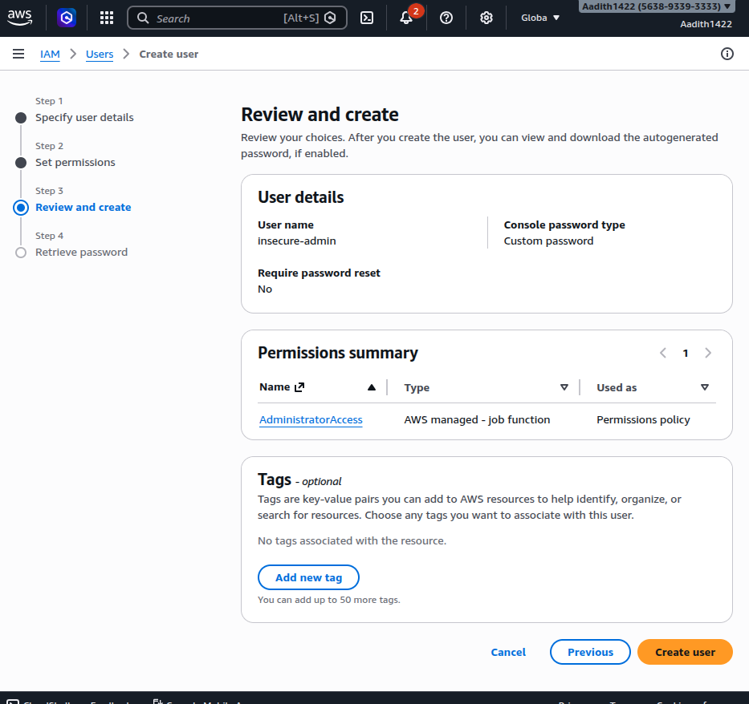

### Screenshot Placeholder (After)

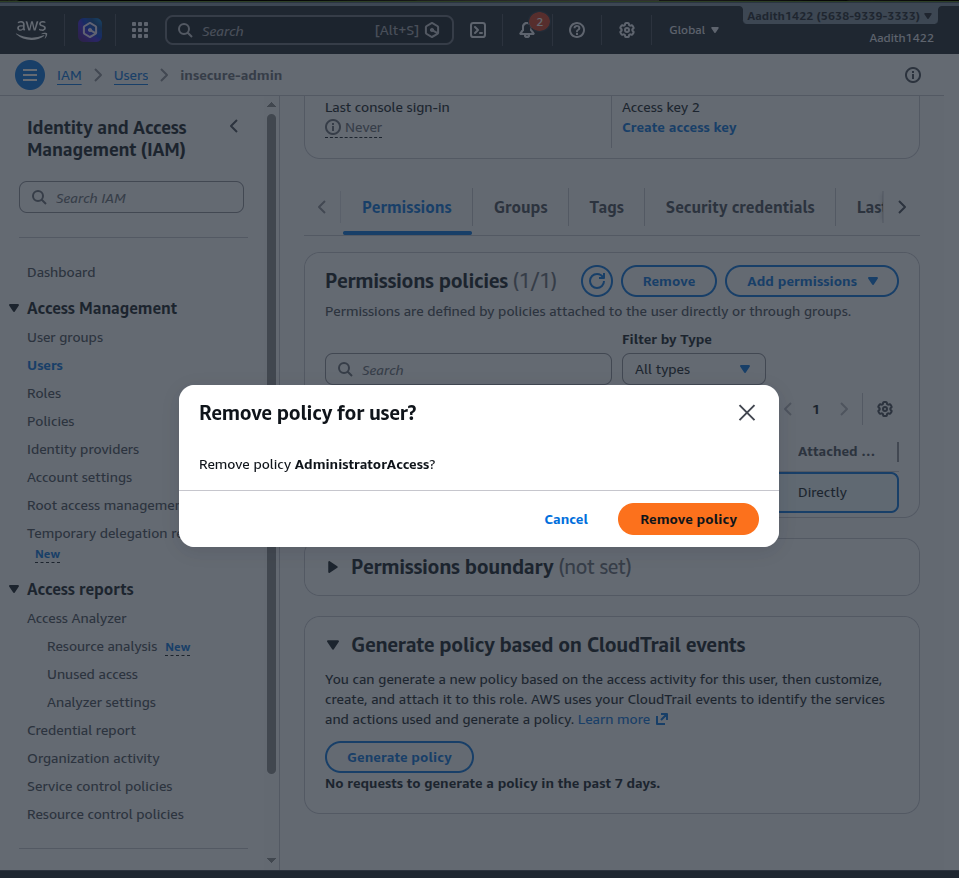

### Security Improvement

-   Prevents full account compromise
-   Reduces privilege escalation risk

### Trade-off

-   Requires granular policy management

------------------------------------------------------------------------

## 3.2 IAM Access Key Management

## Objective

Demonstrate the security risk of long‑term static credentials and
remediate the risk by removing access keys and enforcing secure
authentication practices.

------------------------------------------------------------------------

## 3.2.1 Access Key Creation (Initial Misconfiguration)

### Why This Was Risky

Access keys provide programmatic access to AWS via CLI, SDKs, or APIs.

If: - Stored in plaintext - Committed to GitHub - Hardcoded in
applications - Shared insecurely

They can result in:

• Full account compromise\
• Privilege escalation\
• Data exfiltration\
• Crypto-mining abuse\
• Lateral movement

------------------------------------------------------------------------

### Console Steps (Access Key Creation)

IAM → Users → insecure-admin → Security credentials → Create access key

Select: - Use case: CLI or Application running outside AWS

Download the credentials (.csv file)

------------------------------------------------------------------------

### CLI Verification (After Creation)

aws iam list-access-keys --user-name insecure-admin

Expected Output: Shows Active access key ID associated with user.

------------------------------------------------------------------------

### Screenshot (Access Key Created)

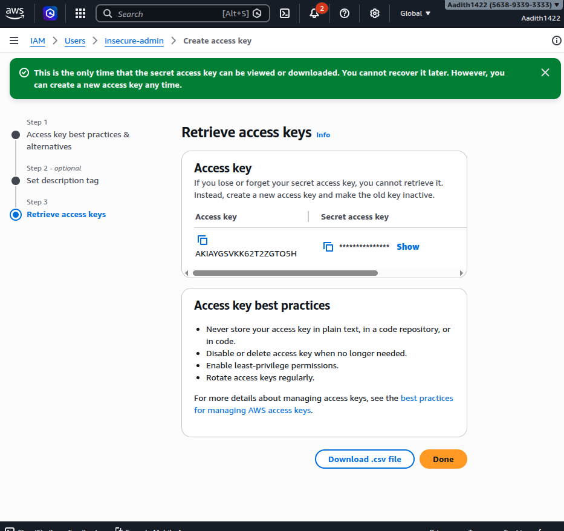

------------------------------------------------------------------------

## 3.2.2 Access Key Deletion (Security Remediation)

After identifying the security risk of static credentials, the access
key was permanently removed.

------------------------------------------------------------------------

### Console Steps (Deletion)

IAM → Users → insecure-admin → Security credentials → Delete access key

Confirm deletion.

------------------------------------------------------------------------

### CLI Command (Deletion)

aws iam delete-access-key --user-name insecure-admin --access-key-id
`<KEY_ID>`{=html}

------------------------------------------------------------------------

### CLI Verification (After Deletion)

aws iam list-access-keys --user-name insecure-admin

Expected Output: No access keys found.

------------------------------------------------------------------------

### Screenshot (Access Key Deleted)

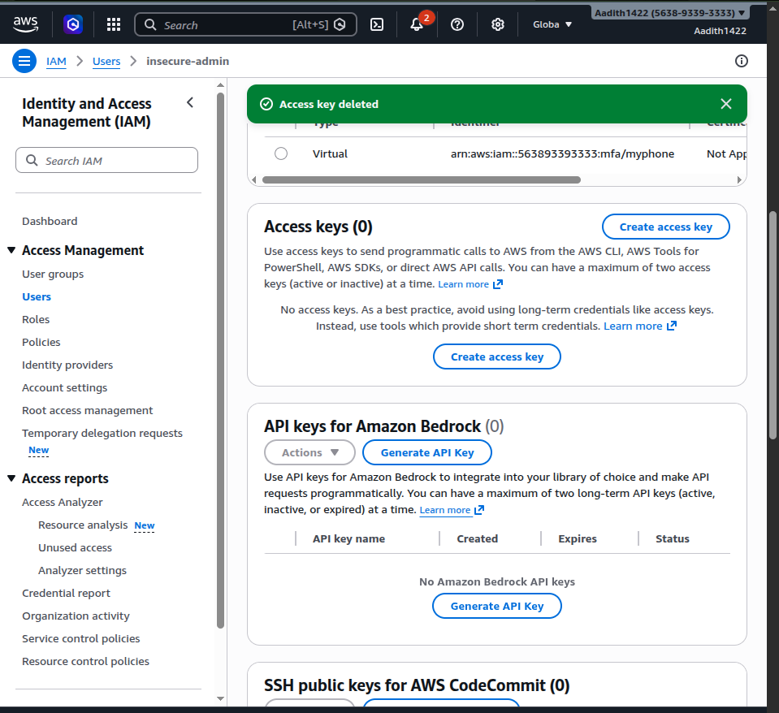

------------------------------------------------------------------------

## Security Improvement Achieved

✔ Eliminates long-term static credential exposure\
✔ Prevents credential leakage via GitHub or logs\
✔ Enforces use of temporary credentials (IAM Roles / STS)\
✔ Reduces insider threat risk\
✔ Aligns with AWS Security Best Practices

------------------------------------------------------------------------

## Enterprise Recommendation

Instead of IAM user access keys:

• Use IAM Roles for EC2\
• Use STS temporary credentials\
• Enable MFA for privileged users\
• Use AWS SSO / Identity Center\
• Monitor IAM activity via CloudTrail

------------------------------------------------------------------------

## Trade-offs

• CLI access becomes role-based\
• Requires proper IAM role configuration\
• Slight operational overhead in credential management

However, the security gain significantly outweighs the operational
complexity.

------------------------------------------------------------------------

## 3.3 Multi-Factor Authentication (MFA) Implementation

### Objective

Strengthen identity security by enabling Multi-Factor Authentication
(MFA) for privileged IAM users to prevent account compromise due to
stolen or leaked passwords.

------------------------------------------------------------------------

### 3.3.1 Risk of No MFA (Initial Misconfiguration)

Without MFA enabled, an attacker who obtains:

-   Leaked password
-   Phishing credentials
-   Brute-forced password
-   Password reuse from another breach

Can gain full access to the AWS account.

This leads to:

• Infrastructure destruction\
• Data exfiltration\
• Creation of backdoor IAM users\
• Cryptocurrency mining abuse\
• Complete cloud environment compromise

------------------------------------------------------------------------

### 3.3.2 MFA Implementation (Security Remediation)

MFA introduces a second authentication factor beyond password, such as:

-   Virtual MFA (Google Authenticator / Authy)
-   Hardware MFA device
-   FIDO2 security key

Authentication now requires:

1.  Username\
2.  Password\
3.  Time-based One-Time Password (TOTP)

------------------------------------------------------------------------

### Console Steps (Enable MFA for IAM User)

IAM → Users → insecure-admin → Security credentials →\
Assign MFA device → Virtual MFA device →\
Scan QR Code using authenticator app →\
Enter two consecutive OTP codes → Activate MFA

------------------------------------------------------------------------

### CLI Verification (Optional)

To verify MFA devices attached to a user:

aws iam list-mfa-devices --user-name insecure-admin

Expected Output: Shows assigned MFA device ARN.

------------------------------------------------------------------------

### Screenshot Placeholder

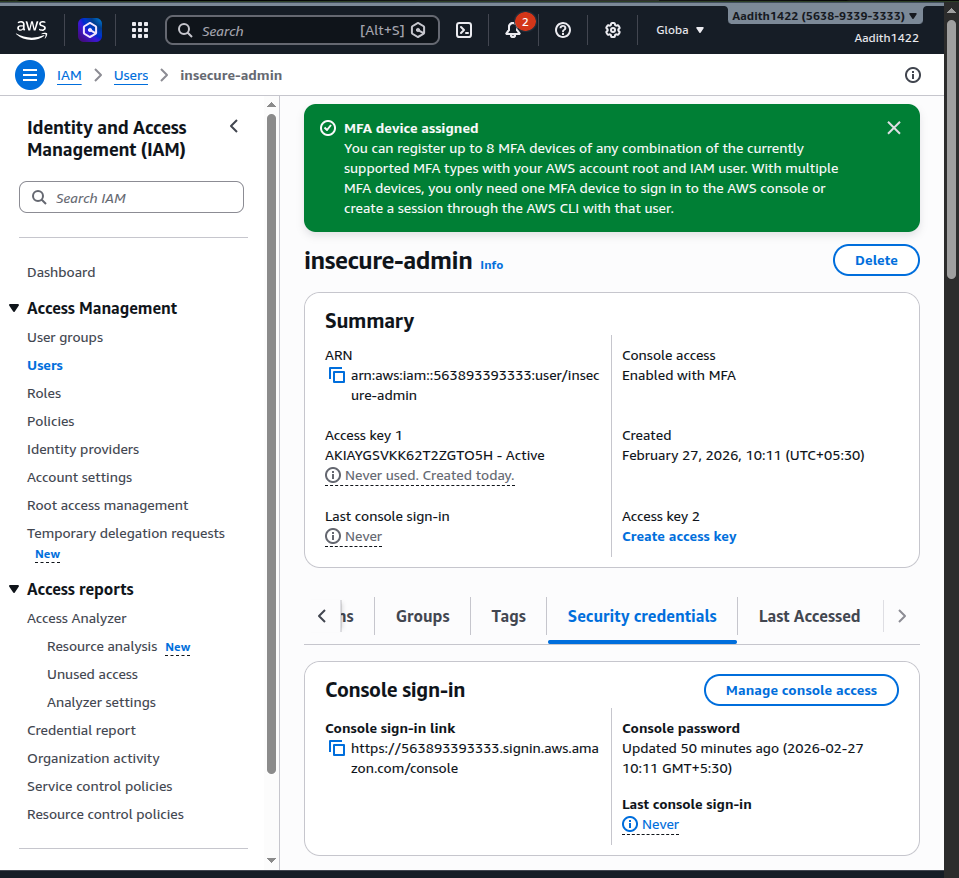

------------------------------------------------------------------------

### Security Improvement Achieved

✔ Prevents account takeover from stolen password\
✔ Mitigates brute-force attacks\
✔ Reduces phishing attack success rate\
✔ Enforces strong authentication control\
✔ Aligns with CIS AWS Benchmark and AWS Best Practices

------------------------------------------------------------------------

### Enterprise-Level Best Practice

For production environments:

• Enforce MFA for all IAM users\
• Require MFA for privileged actions\
• Enable root account MFA\
• Implement IAM policy condition requiring MFA for sensitive API calls

Example Policy Condition:

"Condition": { "Bool": { "aws:MultiFactorAuthPresent": "true" } }

------------------------------------------------------------------------

### Trade-offs

• Slight login complexity increase\
• Users must maintain MFA device\
• Recovery procedures required for lost device

However, MFA provides one of the highest security returns with minimal
operational overhead.

------------------------------------------------------------------------

# 4. S3 Hardening

## 4.1 Block Public Access

### Objective

Remediate public data exposure risk by enabling Amazon S3 Block Public
Access settings at the bucket level.

------------------------------------------------------------------------

## 4.1.1 Initial Misconfiguration (Public Bucket)

The S3 bucket **insecure-lab-public-bucket** was configured with public
access permissions, allowing anonymous users to potentially read
objects.

This configuration can lead to:

• Sensitive data exposure\
• Data scraping\
• Credential leaks\
• Compliance violations\
• Ransomware targeting

------------------------------------------------------------------------

## Console Steps (Enable Block Public Access)

S3 → Buckets → insecure-lab-public-bucket →\
Permissions → Block public access (bucket settings) →\
Edit → Enable all four options:

✔ Block public ACLs\
✔ Ignore public ACLs\
✔ Block public bucket policies\
✔ Restrict public bucket policies

Save changes.

------------------------------------------------------------------------

## CLI Command

aws s3api put-public-access-block --bucket insecure-lab-public-bucket
--public-access-block-configuration
BlockPublicAcls=true,IgnorePublicAcls=true,BlockPublicPolicy=true,RestrictPublicBuckets=true

------------------------------------------------------------------------

## CLI Verification

aws s3api get-public-access-block --bucket insecure-lab-public-bucket

Expected Output: All four settings should be true.

------------------------------------------------------------------------

## Before Screenshot

------------------------------------------------------------------------

## After Screenshot

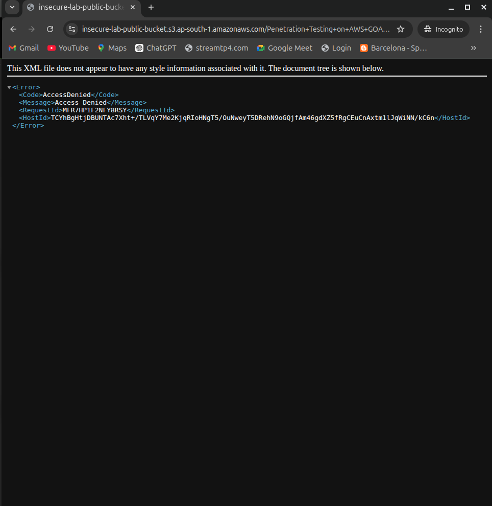

------------------------------------------------------------------------

## Security Improvement

✔ Prevents accidental public exposure\
✔ Overrides permissive bucket policies\
✔ Protects against anonymous access\
✔ Aligns with AWS Security Best Practices\
✔ Compliant with CIS AWS Benchmark Control 2.1

------------------------------------------------------------------------

## Enterprise Impact

This control is considered a **mandatory baseline configuration** in
production environments.

Many real-world breaches (e.g., exposed backups, customer records) were
caused by publicly accessible S3 buckets.

Enabling Block Public Access ensures that even if:

• A developer mistakenly adds a public policy\
• An ACL is misconfigured\
• A policy is copied from insecure documentation

The bucket remains protected.

------------------------------------------------------------------------

## Trade-off

• Public static website hosting requires alternative configuration\
• Must use CloudFront or controlled bucket policies\
• Slight administrative overhead for exceptions

However, the security benefit significantly outweighs the limitations.

------------------------------------------------------------------------

## 4.2 Enable S3 Bucket Versioning

### Objective

Enable object versioning on the S3 bucket to protect against accidental
deletion, malicious overwrites, and ransomware-style data destruction.

------------------------------------------------------------------------

### 4.2.1 Initial Misconfiguration

The bucket **insecure-lab-public-bucket** had versioning disabled.

Risks of disabled versioning:

• Permanent object deletion\
• Accidental overwrite of critical files\
• No rollback capability\
• Increased ransomware impact\
• Loss of forensic evidence

Without versioning, once an object is deleted or replaced, it cannot be
recovered.

------------------------------------------------------------------------

### Console Steps

S3 → Buckets → insecure-lab-public-bucket →\
Properties → Bucket Versioning → Edit →\
Enable → Save changes

------------------------------------------------------------------------

### CLI Command

aws s3api put-bucket-versioning --bucket insecure-lab-public-bucket
--versioning-configuration Status=Enabled

------------------------------------------------------------------------

### CLI Verification

aws s3api get-bucket-versioning --bucket insecure-lab-public-bucket

Expected Output:

{ "Status": "Enabled" }

------------------------------------------------------------------------

### Screenshot

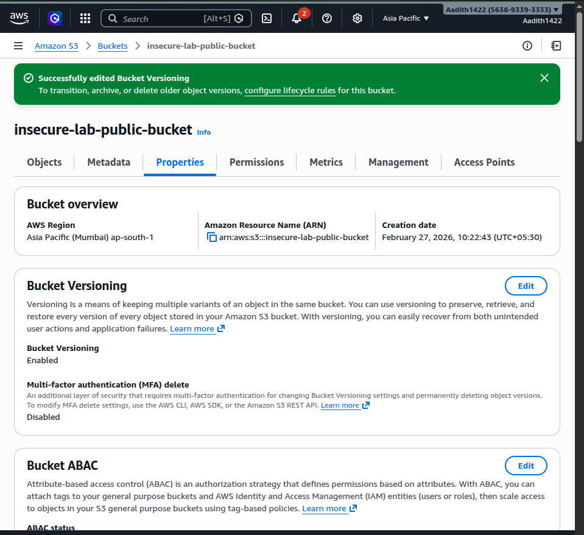

------------------------------------------------------------------------

### Security Benefits

✔ Protects against accidental deletion\
✔ Enables recovery from ransomware attacks\
✔ Maintains historical versions of objects\
✔ Supports forensic investigation\
✔ Aligns with AWS Security Best Practices

------------------------------------------------------------------------

### Ransomware Protection Scenario

If an attacker:

• Gains S3 write access\
• Overwrites objects with encrypted data\
• Deletes original files

With versioning enabled:

• Previous versions remain intact\
• Data can be restored\
• Recovery time is reduced\
• Business continuity is preserved

------------------------------------------------------------------------

### Enterprise Best Practice

For production environments:

• Enable versioning on all critical data buckets\
• Combine with lifecycle policies\
• Enable MFA delete (for highly sensitive data)\
• Use cross-region replication for disaster recovery

------------------------------------------------------------------------

### Trade-offs

• Increased storage cost due to multiple object versions\
• Requires lifecycle policy management\
• Potentially higher storage management complexity

However, the data protection benefit far outweighs the storage cost
increase.

------------------------------------------------------------------------

## 4.3 Enable S3 Server Access Logging

### Objective

Enable Amazon S3 Server Access Logging to capture detailed records of
requests made to the S3 bucket for monitoring, auditing, and forensic
investigation purposes.

------------------------------------------------------------------------

### 4.3.1 Initial Misconfiguration

The bucket **insecure-lab-public-bucket** did not have Server Access
Logging enabled.

Risks of disabled logging:

• No visibility into object access\
• No forensic evidence in case of breach\
• No tracking of suspicious IP addresses\
• No audit trail for compliance requirements\
• Difficult incident response

Without access logging, unauthorized access attempts cannot be properly
investigated.

------------------------------------------------------------------------

### Console Steps

S3 → Buckets → insecure-lab-public-bucket →\
Properties → Server access logging → Edit →

✔ Enable\
Select Target bucket (e.g., aadith-s3-demo)\
(Optional) Set log file prefix

Save changes.

------------------------------------------------------------------------

### CLI Command

aws s3api put-bucket-logging --bucket insecure-lab-public-bucket
--bucket-logging-status '{ "LoggingEnabled": { "TargetBucket":
"aadith-s3-demo", "TargetPrefix": "s3-access-logs/" } }'

------------------------------------------------------------------------

### CLI Verification

aws s3api get-bucket-logging --bucket insecure-lab-public-bucket

Expected Output:

{ "LoggingEnabled": { "TargetBucket": "aadith-s3-demo", "TargetPrefix":
"s3-access-logs/" } }

------------------------------------------------------------------------

### Screenshot

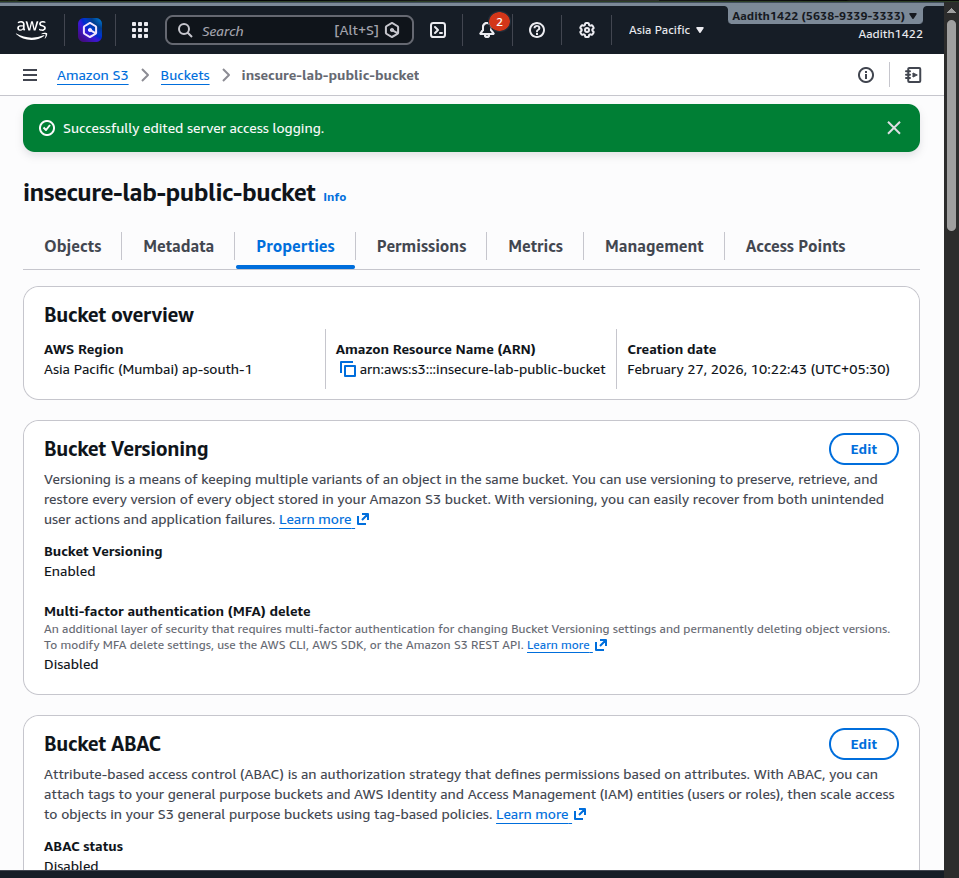

------------------------------------------------------------------------

### Security Benefits

✔ Records all access requests to the bucket\
✔ Captures requester IP address\
✔ Tracks object-level access events\
✔ Enables forensic investigation\
✔ Supports compliance frameworks (ISO, SOC2, PCI-DSS)\
✔ Improves incident response capability

------------------------------------------------------------------------

### Example Attack Scenario

If an attacker:

• Attempts to enumerate objects\
• Downloads sensitive files\
• Performs unusual GET or PUT operations

Server access logs will record:

• Source IP\
• Timestamp\
• Requested object\
• Operation type\
• HTTP response code

This allows:

• Threat identification\
• Timeline reconstruction\
• Legal and compliance reporting

------------------------------------------------------------------------

### Enterprise Best Practices

For production environments:

• Store logs in a separate logging bucket\
• Enable bucket-level encryption on log bucket\
• Restrict access to logging bucket\
• Integrate with CloudWatch or SIEM\
• Use Athena for log analysis

------------------------------------------------------------------------

### Trade-offs

• Additional storage cost for logs\
• Increased S3 requests\
• Requires lifecycle policy to manage log retention

However, the improved visibility and auditability significantly enhance
the security posture.

------------------------------------------------------------------------

## 5. EC2 Hardening

### 5.1 Restrict SSH Access (Port 22)

### Objective

Reduce the attack surface of the EC2 instance by restricting SSH access
(Port 22) to a specific trusted IP address instead of allowing access
from the entire internet (0.0.0.0/0).

------------------------------------------------------------------------

### 5.1.1 Initial Misconfiguration

The EC2 security group allowed inbound SSH traffic from:

0.0.0.0/0

This means:

• Any IP address globally could attempt SSH login\
• Automated bots could brute-force credentials\
• Increased exposure to credential stuffing attacks\
• Higher risk of exploitation if vulnerabilities exist

This is a critical security misconfiguration in cloud environments.

------------------------------------------------------------------------

### Console Steps (Restrict SSH)

EC2 → Security Groups →\
Select Security Group attached to EC2 →\
Edit Inbound Rules →

Remove: Type: SSH\
Port: 22\
Source: 0.0.0.0/0

Add: Type: SSH\
Port: 22\
Source: YOUR_PUBLIC_IP/32

Save changes.

------------------------------------------------------------------------

### CLI Command (Restrict SSH)

Remove existing open rule (if exists):

aws ec2 revoke-security-group-ingress --group-id `<sg-id>`{=html}
--protocol tcp --port 22 --cidr 0.0.0.0/0

Add restricted rule:

aws ec2 authorize-security-group-ingress --group-id `<sg-id>`{=html}
--protocol tcp --port 22 --cidr YOUR_IP/32

------------------------------------------------------------------------

### CLI Verification

aws ec2 describe-security-groups --group-ids `<sg-id>`{=html}

Verify inbound rule shows only YOUR_IP/32 for port 22.

------------------------------------------------------------------------

### Before Screenshot

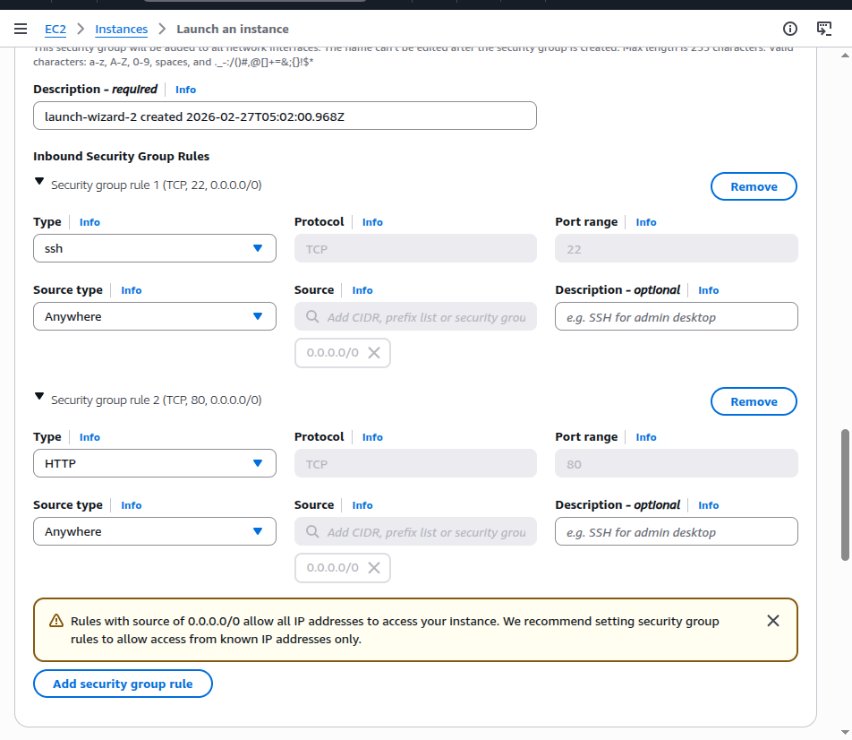

------------------------------------------------------------------------

### After Screenshot

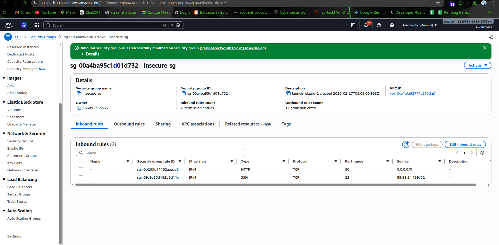

------------------------------------------------------------------------

### Security Improvement

✔ Prevents global brute-force SSH attempts\
✔ Reduces exposure to automated bot attacks\
✔ Limits administrative access to trusted IP\
✔ Aligns with CIS AWS Benchmark Control 4.1\
✔ Reduces overall attack surface

------------------------------------------------------------------------

### Enterprise-Level Best Practices

In production environments:

• Avoid direct SSH exposure entirely\
• Use AWS Systems Manager (SSM Session Manager)\
• Use Bastion Host architecture\
• Implement key-based authentication only\
• Disable password authentication\
• Enable CloudTrail monitoring for security group changes

------------------------------------------------------------------------

### Attack Scenario (If Not Restricted)

If SSH remains open to 0.0.0.0/0:

• Attackers scan public IP ranges\
• Identify open port 22\
• Launch brute-force attempts\
• Attempt credential reuse attacks\
• Exploit unpatched vulnerabilities

Restricting SSH drastically reduces this exposure.

------------------------------------------------------------------------

### Trade-offs

• Access limited to specific IP (may require updating if IP changes)\
• Remote administrators must manage trusted IP list\
• Slight operational overhead

However, security gain significantly outweighs minor operational
inconvenience.

------------------------------------------------------------------------

## 5.2 Remove Public IP Address from EC2 Instance

### Objective

Eliminate direct internet exposure of the EC2 instance by removing the
assigned Public IPv4 address and ensuring access occurs only through
controlled entry points (e.g., ALB, Bastion Host, or AWS Systems
Manager).

------------------------------------------------------------------------

### 5.2.1 Initial Misconfiguration

The EC2 instance had a Public IPv4 address assigned.

Risks of having a public IP:

• Direct internet exposure\
• Increased attack surface\
• Public port scanning detection\
• Automated vulnerability exploitation\
• Bypass of WAF or Load Balancer controls\
• Higher brute-force attempt rate

Even if security groups are configured correctly, a public IP
significantly increases exposure risk.

------------------------------------------------------------------------

### Console Steps (Remove Public IP)

EC2 → Instances → Select Instance →\
Networking → Manage IP addresses →

If Elastic IP attached: • Disassociate Elastic IP\
• Release Elastic IP (if no longer needed)

If Auto-assigned public IP: • Stop instance\
• Modify subnet setting (Disable auto-assign public IP)\
• Relaunch or reconfigure instance in private subnet

Save changes.

------------------------------------------------------------------------

### CLI Commands (If Elastic IP Attached)

Disassociate Elastic IP:

aws ec2 disassociate-address --association-id `<association-id>`{=html}

Release Elastic IP:

aws ec2 release-address --allocation-id `<allocation-id>`{=html}

------------------------------------------------------------------------

### Verification

aws ec2 describe-instances --instance-ids `<instance-id>`{=html} --query
"Reservations\[\*\].Instances\[\*\].PublicIpAddress"

Expected Output: null

------------------------------------------------------------------------

### Screenshot

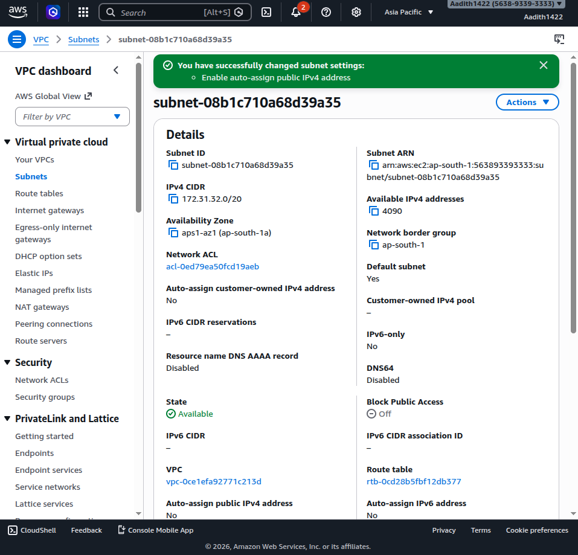

------------------------------------------------------------------------

## Security Improvement

✔ Eliminates direct internet access\
✔ Forces traffic through ALB/WAF layer\
✔ Reduces exposure to internet-wide scans\
✔ Prevents bypass of perimeter security controls\
✔ Supports Zero Trust architecture model

------------------------------------------------------------------------

### Enterprise Architecture Impact

With Public IP removed, architecture becomes:

Internet\
↓\
Application Load Balancer\
↓\
AWS WAF\
↓\
Private EC2 Instance

This enforces layered defense and centralized ingress control.

------------------------------------------------------------------------

### Attack Scenario (If Public IP Remains)

If EC2 keeps public IP:

• Attackers scan for open ports\
• Attempt direct SSH or HTTP access\
• Attempt vulnerability exploitation\
• Attempt bypass of load balancer protections

Removing Public IP ensures no direct communication from the internet to
the compute layer.

------------------------------------------------------------------------

### Enterprise Best Practices

• Deploy EC2 in private subnets\
• Use NAT Gateway for outbound access\
• Use ALB/NLB for inbound traffic\
• Use AWS Systems Manager Session Manager for administrative access\
• Enable VPC Flow Logs for monitoring

------------------------------------------------------------------------

### Trade-offs

• Requires additional architecture (ALB, NAT, Bastion)\
• Slight increase in infrastructure cost\
• More complex network design

However, the drastic reduction in attack surface justifies the added
complexity.

------------------------------------------------------------------------

## 5.3 Enforce IMDSv2 (Instance Metadata Service Version 2)

### Objective

Enhance EC2 instance security by enforcing Instance Metadata Service
Version 2 (IMDSv2), which mitigates Server-Side Request Forgery (SSRF)
attacks and prevents unauthorized credential theft from the metadata
endpoint.

------------------------------------------------------------------------

### 5.3.1 Initial Misconfiguration

The EC2 instance allowed IMDSv1 (Instance Metadata Service Version 1).

Risks of IMDSv1:

• Vulnerable to SSRF attacks\
• No session authentication\
• Metadata accessible via simple HTTP request\
• Potential exposure of IAM role credentials\
• Lateral movement risk

If an attacker exploits a web application vulnerability (e.g., SSRF),
they can query:

http://169.254.169.254/latest/meta-data/

And retrieve temporary IAM credentials.

------------------------------------------------------------------------

### 5.3.2 Security Remediation -- Enforce IMDSv2

IMDSv2 requires:

• Session-based authentication\
• PUT request to retrieve token\
• Token required for metadata access\
• Protection against open proxy abuse

------------------------------------------------------------------------

### CLI Command

aws ec2 modify-instance-metadata-options --instance-id
`<instance-id>`{=html} --http-tokens required

------------------------------------------------------------------------

### CLI Verification

aws ec2 describe-instances --instance-ids `<instance-id>`{=html} --query
"Reservations\[\*\].Instances\[\*\].MetadataOptions"

Expected Output:

{ "HttpTokens": "required", "HttpEndpoint": "enabled" }

------------------------------------------------------------------------

### Screenshot

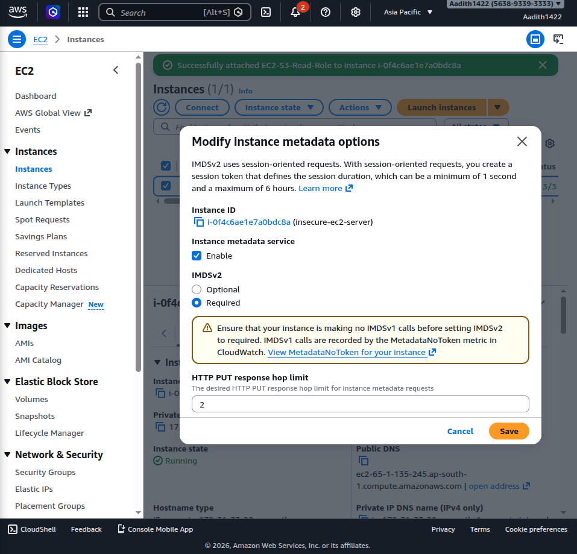

------------------------------------------------------------------------

## Security Benefit

✔ Prevents SSRF-based credential theft\
✔ Requires authenticated metadata session\
✔ Protects IAM role temporary credentials\
✔ Reduces risk of application-level exploitation\
✔ Aligns with AWS Security Best Practices

------------------------------------------------------------------------

### Attack Scenario (If IMDSv1 Enabled)

If a vulnerable web application exists on the instance:

• Attacker injects malicious request\
• Application fetches metadata from 169.254.169.254\
• Temporary IAM credentials are retrieved\
• Attacker uses credentials to access S3, EC2, or other services

Enforcing IMDSv2 blocks this attack path.

------------------------------------------------------------------------

### Enterprise Best Practices

• Always require IMDSv2 for all production EC2 instances\
• Combine with least privilege IAM roles\
• Monitor metadata access via CloudTrail\
• Regularly patch EC2 instances\
• Conduct SSRF testing in security reviews

------------------------------------------------------------------------

### Trade-offs

• Legacy applications using IMDSv1 may require modification\
• Slight configuration management overhead\
• Requires validation during deployment

However, the security benefit significantly outweighs compatibility
concerns.

------------------------------------------------------------------------

## 5.4 Attach IAM Role to EC2 Instance

### Objective

Eliminate the use of hardcoded credentials by attaching an IAM Role to
the EC2 instance, enabling secure access to AWS services using temporary
credentials provided by AWS Security Token Service (STS).

------------------------------------------------------------------------

### 5.4.1 Initial Misconfiguration

Before remediation:

• EC2 instance had no IAM role attached\
• Application required AWS access (e.g., S3)\
• Risk of storing access keys locally\
• Potential credential leakage through: - Source code - Configuration
files - Environment variables - Git repositories

Hardcoded credentials are one of the most common causes of cloud
breaches.

------------------------------------------------------------------------

### 5.4.2 Security Remediation -- Use IAM Role

IAM Roles provide:

• Temporary credentials\
• Automatic credential rotation\
• No secret storage required\
• Scoped least privilege permissions

When attached to EC2:

• Instance retrieves credentials securely from metadata service\
• Credentials automatically rotate\
• No manual key management required

------------------------------------------------------------------------

### Console Steps

IAM → Roles → Create Role →\
Trusted entity: EC2 →\
Attach permission policy (e.g., Limited-S3-Read-Policy) →\
Name role: EC2-S3-Read-Role → Create Role

Then:

EC2 → Instances → Select instance →\
Actions → Security → Modify IAM Role →\
Select EC2-S3-Read-Role → Save

------------------------------------------------------------------------

### CLI Commands

Create role:

aws iam create-role --role-name EC2-S3-Read-Role
--assume-role-policy-document file://trust-policy.json

Attach policy:

aws iam attach-role-policy --role-name EC2-S3-Read-Role --policy-arn
arn:aws:iam::`<account-id>`{=html}:policy/Limited-S3-Read-Policy

Attach role to EC2 instance:

aws ec2 associate-iam-instance-profile --instance-id
`<instance-id>`{=html} --iam-instance-profile Name=EC2-S3-Read-Role

------------------------------------------------------------------------

### CLI Verification

aws ec2 describe-instances --instance-ids `<instance-id>`{=html} --query
"Reservations\[\*\].Instances\[\*\].IamInstanceProfile"

Expected Output: Instance profile ARN displayed.

------------------------------------------------------------------------

### Screenshot

------------------------------------------------------------------------

### Security Benefits

✔ Eliminates hardcoded credentials\
✔ Uses temporary rotating credentials\
✔ Reduces risk of credential leakage\
✔ Enforces least privilege access\
✔ Supports Zero Trust security model\
✔ Aligns with AWS Best Practices

------------------------------------------------------------------------

### Attack Scenario (If Access Keys Were Used Instead)

If access keys were stored on EC2:

• Attacker gains shell access\
• Reads AWS credentials from config files\
• Uses credentials to access S3, EC2, IAM\
• Escalates privileges\
• Exfiltrates sensitive data

IAM roles prevent this by avoiding static secrets.

------------------------------------------------------------------------

### Enterprise Best Practices

• Always use IAM roles for EC2\
• Apply least privilege policies\
• Avoid attaching overly permissive policies\
• Monitor role usage with CloudTrail\
• Combine with IMDSv2 enforcement

------------------------------------------------------------------------

### Trade-offs

• Requires proper IAM role configuration\
• Applications must rely on IAM role authentication\
• Policy management complexity increases

However, the elimination of static credentials significantly improves
the overall security posture.

------------------------------------------------------------------------
## 6. VPC & Security Group Hardening

### 6.1 Private Backend Security Group Configuration

### Objective

Implement network-level isolation by configuring the EC2 backend
security group to allow inbound traffic **only from the Application Load
Balancer (ALB)** security group and explicitly prevent direct internet
exposure (no 0.0.0.0/0).

------------------------------------------------------------------------

### 6.1.1 Initial Misconfiguration

Previously, the EC2 instance security group allowed:

Inbound: - HTTP (80) from 0.0.0.0/0 - SSH (22) from 0.0.0.0/0

Risks:

• Direct internet access to backend server\
• Bypass of Load Balancer and WAF controls\
• Increased attack surface\
• Port scanning exposure\
• Direct exploitation attempts\
• Lateral movement risk

This violates the principle of **Defense in Depth**.

------------------------------------------------------------------------

### 6.1.2 Security Remediation -- Private Backend Model

Architecture enforced:

Internet\
↓\
Application Load Balancer\
↓\
Private EC2 Instance

The EC2 instance should only accept traffic from the ALB security group.

------------------------------------------------------------------------

### Console Steps

EC2 → Security Groups → Select EC2 Security Group → Edit Inbound Rules

Remove: - HTTP 80 → 0.0.0.0/0 - Any unnecessary open rules

Add: - HTTP 80 → Source: ALB Security Group (sg-xxxxxxxx)

Ensure: - No inbound rule contains 0.0.0.0/0 - SSH restricted or removed
entirely

Save changes.

------------------------------------------------------------------------

### CLI Commands

Revoke open HTTP rule:

aws ec2 revoke-security-group-ingress --group-id `<ec2-sg-id>`{=html}
--protocol tcp --port 80 --cidr 0.0.0.0/0

Allow only ALB Security Group:

aws ec2 authorize-security-group-ingress --group-id `<ec2-sg-id>`{=html}
--protocol tcp --port 80 --source-group `<alb-sg-id>`{=html}

------------------------------------------------------------------------

### CLI Verification

aws ec2 describe-security-groups --group-ids `<ec2-sg-id>`{=html}

Verify inbound rules show:

-   Port 80 → Source: ALB Security Group
-   No 0.0.0.0/0 entries

------------------------------------------------------------------------

### Screenshot

------------------------------------------------------------------------

## Security Improvements

✔ Enforces network segmentation\
✔ Prevents direct backend exposure\
✔ Forces all traffic through ALB and WAF\
✔ Reduces attack surface\
✔ Supports Zero Trust network design\
✔ Aligns with AWS Well-Architected Security Pillar

------------------------------------------------------------------------

### Attack Scenario (If Backend Is Public)

If backend allows 0.0.0.0/0:

• Attacker bypasses ALB\
• Bypasses WAF inspection\
• Directly targets application server\
• Attempts exploit payloads\
• Launches DDoS or brute-force attacks

Restricting to ALB ensures inspection and centralized ingress control.

------------------------------------------------------------------------

### Enterprise Best Practices

• Separate public and private subnets\
• Deploy backend instances only in private subnets\
• Use NAT Gateway for outbound internet access\
• Enable VPC Flow Logs\
• Regularly audit security group rules\
• Use Infrastructure as Code (IaC) for rule management

------------------------------------------------------------------------

### Trade-offs

• Requires ALB or Bastion architecture\
• Slight increase in infrastructure cost\
• More complex network management

However, eliminating direct internet exposure significantly improves
overall security posture.

------------------------------------------------------------------------

# 7. AWS CloudTrail Implementation

## Objective

Enable AWS CloudTrail to provide full audit logging of all API activity
across the AWS account, ensuring visibility, traceability, and
compliance monitoring.

------------------------------------------------------------------------

## 7.1 Initial Misconfiguration

CloudTrail was not enabled in the AWS account.

Risks:

• No visibility into API activity\
• No audit trail for IAM changes\
• No detection of malicious actions\
• No forensic investigation capability\
• Compliance violations (CIS, ISO, SOC2, PCI-DSS)

Without CloudTrail, administrative actions cannot be traced.

------------------------------------------------------------------------

## 7.2 Create Multi-Region Trail

A multi-region trail ensures all AWS regions are monitored, preventing
attackers from operating in unused regions without detection.

------------------------------------------------------------------------

## CLI Commands

Create trail:

aws cloudtrail create-trail --name secure-multi-region-trail
--s3-bucket-name aadith-s3-demo --is-multi-region-trail

Start logging:

aws cloudtrail start-logging --name secure-multi-region-trail

------------------------------------------------------------------------

## CLI Verification

aws cloudtrail describe-trails

aws cloudtrail get-trail-status --name secure-multi-region-trail

Expected Output:

"IsLogging": true

------------------------------------------------------------------------

## Screenshot -- Trail Active

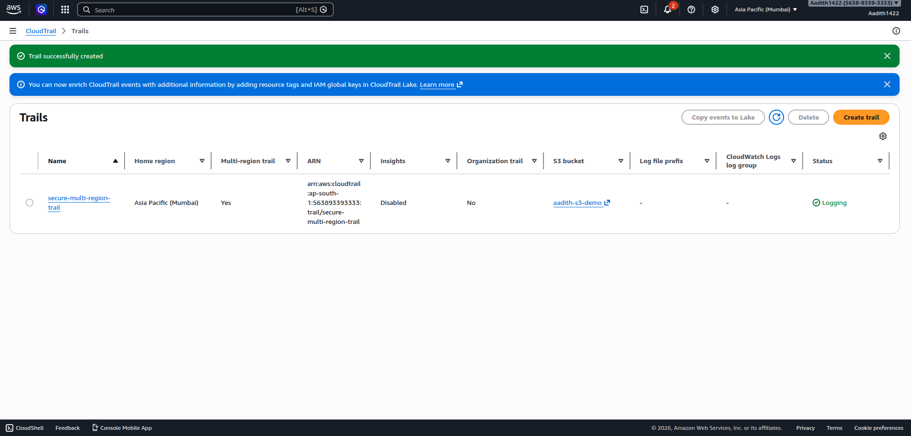

------------------------------------------------------------------------

## (Optional Enhancement) CloudWatch Logs Integration

CloudTrail logs were integrated with CloudWatch for real-time monitoring
and alerting.

Screenshot:

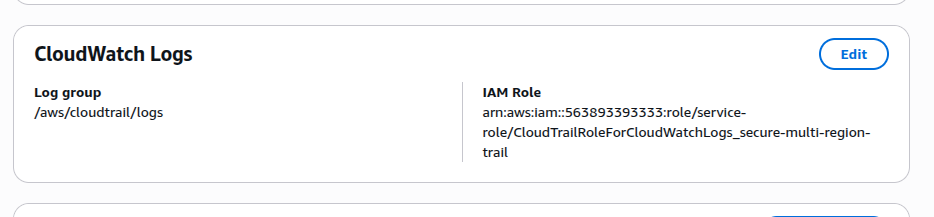

------------------------------------------------------------------------

## Security Improvements

✔ Full API activity visibility\
✔ Tracks IAM changes\
✔ Detects unauthorized actions\
✔ Enables forensic investigation\
✔ Supports compliance frameworks\
✔ Enables real-time alerting (via CloudWatch)\
✔ Detects insider threats

------------------------------------------------------------------------

## Attack Scenario (If CloudTrail Disabled)

If CloudTrail is not enabled:

• Attacker creates new IAM user\
• Attacker attaches AdministratorAccess\
• Attacker deletes S3 objects\
• Attacker launches crypto-mining EC2 instances

Without logs: • No evidence\
• No traceability\
• No accountability

With CloudTrail: • Every action recorded\
• Source IP logged\
• Timestamp captured\
• Identity tracked

------------------------------------------------------------------------

## Enterprise Best Practices

• Enable multi-region trail\
• Enable log file validation\
• Store logs in dedicated logging account\
• Enable CloudWatch integration\
• Enable AWS Config for drift detection\
• Enable GuardDuty for threat detection

------------------------------------------------------------------------

## Trade-offs

• Increased S3 storage cost\
• Increased CloudWatch cost (if enabled)\
• Log management overhead

However, CloudTrail is considered a mandatory baseline control in all
production AWS environments.

------------------------------------------------------------------------

# 8. AWS Config -- Continuous Compliance & Drift Detection

## Objective

Enable AWS Config to provide continuous monitoring, configuration
tracking, compliance validation, and drift detection across all AWS
resources.

AWS Config records configuration changes over time and evaluates them
against compliance rules.

------------------------------------------------------------------------

## 8.1 Initial Misconfiguration

AWS Config was not enabled in the account.

Risks Identified:

• No configuration history\
• No drift detection\
• No compliance visibility\
• No rule-based governance enforcement\
• No resource change tracking\
• Limited forensic capability

Without AWS Config, infrastructure misconfigurations may go unnoticed.

------------------------------------------------------------------------

## 8.2 Enable Configuration Recorder

The configuration recorder captures supported AWS resource changes and
stores them in S3.

------------------------------------------------------------------------

## CLI Commands

Create / update configuration recorder:

aws configservice put-configuration-recorder --configuration-recorder
name=default,roleARN=`<role-arn>`{=html}

Start recorder:

aws configservice start-configuration-recorder
--configuration-recorder-name default

------------------------------------------------------------------------

## CLI Verification

aws configservice describe-configuration-recorders

aws configservice describe-configuration-recorder-status

Expected Output:

"recording": true

------------------------------------------------------------------------

## Screenshot -- Configuration Recorder Enabled

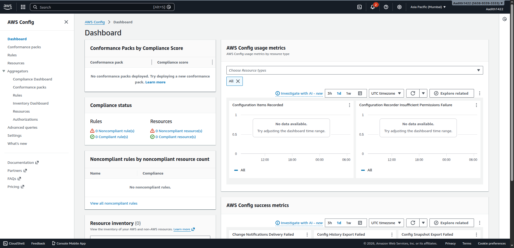

------------------------------------------------------------------------

## 8.3 Recording Scope

Recorder configured to:

• Record all supported resource types\
• Include global resources (IAM, etc.)\
• Continuous recording mode enabled

This ensures complete configuration tracking across the environment.

------------------------------------------------------------------------

## 8.4 Security Improvements

✔ Continuous compliance monitoring\
✔ Detects unauthorized configuration changes\
✔ Enables automated compliance checks\
✔ Provides full configuration history\
✔ Supports audit and regulatory requirements\
✔ Enables drift detection\
✔ Integrates with Security Hub

------------------------------------------------------------------------

## Attack Scenario (Without AWS Config)

If AWS Config is not enabled:

• Attacker opens port 22 to 0.0.0.0/0\
• Attacker disables logging\
• Attacker modifies IAM policies

Without Config: • No visibility of change history\
• No compliance alerts\
• No drift awareness

With Config: • Every change recorded\
• Compliance rule violation triggered\
• Timeline view available\
• Source and timestamp logged

------------------------------------------------------------------------

## Enterprise Best Practices

• Enable in all regions\
• Deliver logs to dedicated logging account\
• Enable AWS managed compliance rules\
• Integrate with Security Hub\
• Enable Config Aggregator for multi-account visibility\
• Enable remediation using SSM Automation

------------------------------------------------------------------------

## Trade-offs

• Additional S3 storage cost\
• Evaluation cost per rule\
• Increased log management overhead

However, AWS Config is considered a mandatory governance control in
production environments.

------------------------------------------------------------------------

# 9. Application Load Balancer (ALB) Deployment & Security Architecture

## Objective

Deploy an Application Load Balancer (ALB) to serve as the secure and
centralized entry point for web traffic into the AWS environment.

The ALB ensures controlled exposure of backend EC2 instances and
supports integration with AWS WAF, TLS termination, and advanced
routing.

------------------------------------------------------------------------

## 9.1 Initial Architecture Risk

Before ALB deployment:

• EC2 instance was directly exposed to the internet\
• Public IP attached to EC2\
• Security group allowed inbound HTTP/SSH\
• No centralized inspection layer\
• No WAF integration capability

This architecture increases:

• Attack surface\
• Risk of direct exploitation\
• Lateral movement exposure\
• DDoS vulnerability

------------------------------------------------------------------------

## 9.2 Create Application Load Balancer

The ALB was created as an internet-facing load balancer across two
Availability Zones to ensure high availability.

------------------------------------------------------------------------

## CLI Command

aws elbv2 create-load-balancer --name secure-alb --subnets
`<subnet1>`{=html} `<subnet2>`{=html} --scheme internet-facing --type
application --ip-address-type ipv4

------------------------------------------------------------------------

## CLI Verification

aws elbv2 describe-load-balancers

Expected Output:

• LoadBalancerArn present\
• Scheme: internet-facing\
• Type: application\
• State: active

------------------------------------------------------------------------

## Screenshot -- ALB Created

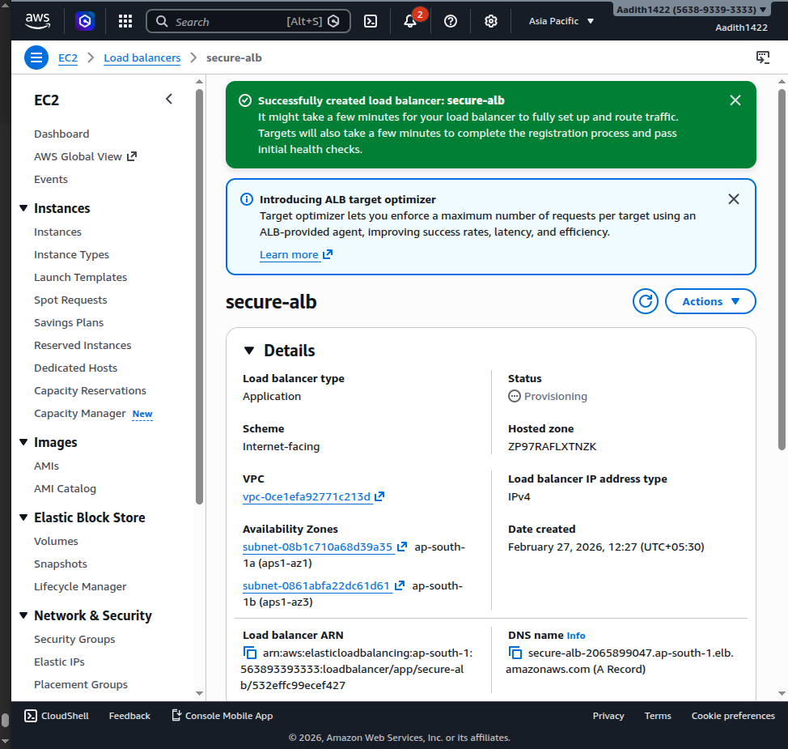

------------------------------------------------------------------------

## 9.3 Target Group & Backend Registration

After ALB creation:

• Target group created\
• EC2 instance registered as target\
• Health checks configured\
• Backend moved to private security group

This ensures backend EC2 is not directly accessible from the internet.

------------------------------------------------------------------------

## 9.4 Security Improvements

✔ Centralized traffic entry point\
✔ Backend isolation (private EC2)\
✔ Enables WAF protection\
✔ Supports HTTPS termination\
✔ Enables path-based routing\
✔ Improves availability (multi-AZ)\
✔ Reduces attack surface

------------------------------------------------------------------------

## 9.5 Architecture Before vs After

Before:

Internet → EC2 (Public IP)

After:

Internet → ALB → Private EC2

This design enforces layered security and follows AWS Well-Architected
best practices.

------------------------------------------------------------------------

## 9.6 Attack Scenario (Without ALB)

If EC2 is directly exposed:

• Attacker scans public IP\
• Exploits open port\
• Attempts brute force\
• Directly attacks application

With ALB:

• Only ALB exposed\
• WAF can inspect traffic\
• Backend isolated\
• Health checks prevent routing to unhealthy targets

------------------------------------------------------------------------

## 9.7 Enterprise Best Practices

• Deploy ALB across minimum two AZs\
• Use HTTPS with ACM certificate\
• Redirect HTTP to HTTPS\
• Integrate with AWS WAF\
• Enable access logs\
• Use private subnets for backend EC2\
• Apply least-privilege security groups

------------------------------------------------------------------------

## Trade-offs

• Additional cost (ALB hourly + LCU charges)\
• Slight latency increase\
• Operational complexity

However, ALB is mandatory in production-grade secure architectures.

------------------------------------------------------------------------
# 10. AWS Web Application Firewall (WAF)

## Objective

Deploy AWS WAF to protect the Application Load Balancer (ALB) from
common web-based attacks including SQL injection (SQLi), Cross-Site
Scripting (XSS), command injection, bad bots, and malicious input
patterns.

AWS WAF adds an application-layer (Layer 7) security control in front of
the ALB.

------------------------------------------------------------------------

## 10.1 Initial Risk (Before WAF)

Before WAF implementation:

• No Layer 7 inspection\
• No filtering of malicious payloads\
• Application directly exposed to web-based attacks\
• No protection against OWASP Top 10 attacks\
• No IP reputation filtering

Risks:

• SQL Injection\
• XSS attacks\
• Remote command execution attempts\
• Credential stuffing\
• Bot scraping\
• API abuse

------------------------------------------------------------------------

## 10.2 Create Web ACL

A Web ACL (Access Control List) was created with AWS Managed Rule Groups
including:

• AWSManagedRulesCommonRuleSet\
• AWSManagedRulesSQLiRuleSet\
• AWSManagedRulesKnownBadInputsRuleSet\
• AWSManagedRulesAmazonIpReputationList

------------------------------------------------------------------------

## CLI Commands

Create Web ACL:

aws wafv2 create-web-acl --name secure-alb-waf --scope REGIONAL
--default-action Allow={} --visibility-config
SampledRequestsEnabled=true,CloudWatchMetricsEnabled=true,MetricName=secure-alb-waf
--rules file://waf-rules.json

Associate Web ACL with ALB:

aws wafv2 associate-web-acl --web-acl-arn `<web-acl-arn>`{=html}
--resource-arn `<alb-arn>`{=html}

------------------------------------------------------------------------

## CLI Verification

aws wafv2 get-web-acl --name secure-alb-waf --scope REGIONAL

aws wafv2 list-resources-for-web-acl --web-acl-arn
`<web-acl-arn>`{=html}

------------------------------------------------------------------------

## Screenshot -- WAF Enabled

------------------------------------------------------------------------

## 10.3 Security Improvements

✔ Blocks SQL injection attempts\
✔ Blocks XSS payloads\
✔ Filters known malicious IPs\
✔ Prevents common bad input patterns\
✔ Protects against OWASP Top 10\
✔ Adds inspection before traffic reaches backend\
✔ Reduces exploitation attempts

------------------------------------------------------------------------

## 10.4 Architecture After WAF

Internet\
↓\
AWS WAF\
↓\
Application Load Balancer\
↓\
Private EC2 Backend

This creates a layered defense model.

------------------------------------------------------------------------

## 10.5 Attack Scenario (Without WAF)

If WAF is not enabled:

• Attacker sends SQL injection payload\
• Backend processes malicious query\
• Database compromise possible

With WAF enabled:

• Payload inspected\
• Rule triggered\
• Request blocked\
• Event logged

------------------------------------------------------------------------

## 10.6 Monitoring & Visibility

WAF provides:

• Sampled requests\
• CloudWatch metrics\
• Blocked request visibility\
• IP tracking\
• Rule match analytics

------------------------------------------------------------------------

## 10.7 Enterprise Best Practices

• Use AWS Managed Rule Sets\
• Add custom rate-limiting rule\
• Enable logging to S3 or CloudWatch\
• Enable bot control\
• Review blocked traffic regularly\
• Integrate with Security Hub

------------------------------------------------------------------------

## Trade-offs

• Additional cost per request\
• Potential false positives\
• Rule tuning required\
• Slight latency overhead

However, WAF is mandatory for internet-facing production workloads.

------------------------------------------------------------------------

# 11. Before vs After Summary

  Component    Before      After
  ------------ ----------- -----------------
  IAM          Admin       Least Privilege
  S3           Public      Private
  EC2          Public IP   Private
  SSH          Open        Restricted
  CloudTrail   Disabled    Enabled
  Config       Disabled    Enabled
  WAF          None        Active

------------------------------------------------------------------------

# 12. Trade-offs

-   Increased AWS cost (CloudTrail, Config, WAF)
-   More complex management
-   Requires ongoing monitoring

------------------------------------------------------------------------

# 13. Final Secure Architecture

Internet\
↓\
ALB\
↓\
WAF\
↓\
Private EC2

------------------------------------------------------------------------

# 14. Conclusion

The environment has been successfully transformed from an insecure
configuration to an enterprise-grade hardened AWS architecture.

Security principles applied:

-   Least Privilege
-   Defense in Depth
-   Secure by Default
-   Continuous Monitoring
-   Reduced Attack Surface

------------------------------------------------------------------------

# END OF REPORT
