# Azure Cloud Security Hardening & Misconfiguration Remediation Report

## Prepared By

Aadith C H\
Azure Subscription: Azure subscription 1\
Primary Resource Group: Insecure-Lab-RG\
Region(s): East US / Central India

------------------------------------------------------------------------

# 1. Introduction

This report documents the complete security hardening of an
intentionally vulnerable Azure lab environment.

The objective was to:

-   Identify Azure misconfigurations
-   Apply Microsoft security best practices
-   Document Portal and CLI remediation steps
-   Capture before/after evidence
-  

------------------------------------------------------------------------

# 2. Initial Misconfigurations Identified

This section documents the security weaknesses discovered in the Azure
lab before remediation. Each finding includes associated risks and
supporting evidence.

------------------------------------------------------------------------

## 2.1 Identity & Access Management (Microsoft Entra ID)

### Initial State

The privileged Azure user account had:

-   MFA disabled\
-   No conditional access enforcement\
-   Single-factor authentication only\
-   No policy-based protection for sensitive actions

### Risk Analysis

Without MFA or conditional access:

-   Stolen passwords lead to full subscription compromise\
-   Phishing attacks succeed easily\
-   Brute-force attempts have higher success probability\
-   No adaptive risk-based authentication\
-   No protection against credential reuse attacks

If attacker gains access:

• Resource deletion\
• Data exfiltration\
• Privilege escalation\
• Creation of backdoor accounts\
• Subscription takeover

### Screenshot Evidence (Before)

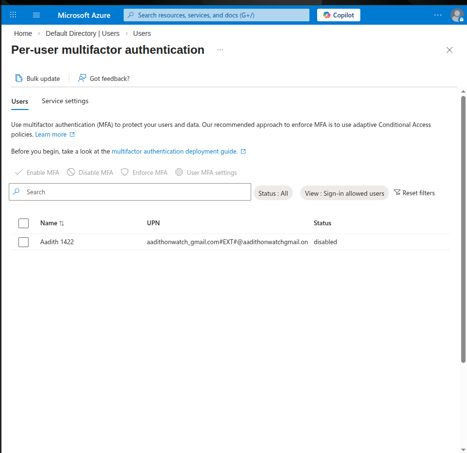

------------------------------------------------------------------------

## 2.2 Storage Account Misconfiguration

### Initial State

The storage account **insecurestorage123** was configured with:

-   Blob anonymous access enabled\
-   Container access level set to Public (Blob)\
-   Public network access allowed\
-   No diagnostic logging configured

### Risk Analysis

This configuration exposes the environment to:

• Public data exposure\
• Sensitive document leakage\
• Source code disclosure\
• Backup file exposure\
• Compliance violations (ISO, SOC2, GDPR)\
• OSINT-based reconnaissance

Public containers allow direct object access via URL:

`https://<storage-account>.blob.core.windows.net/<container>/<file>`

If sensitive files are uploaded, they become publicly accessible.

### Screenshot Evidence (Before)

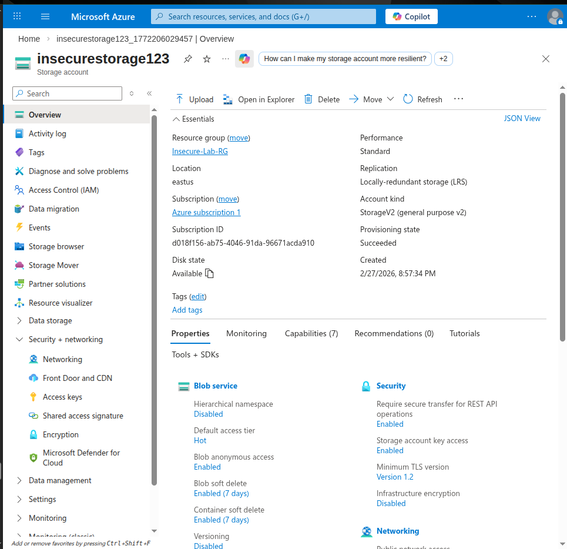

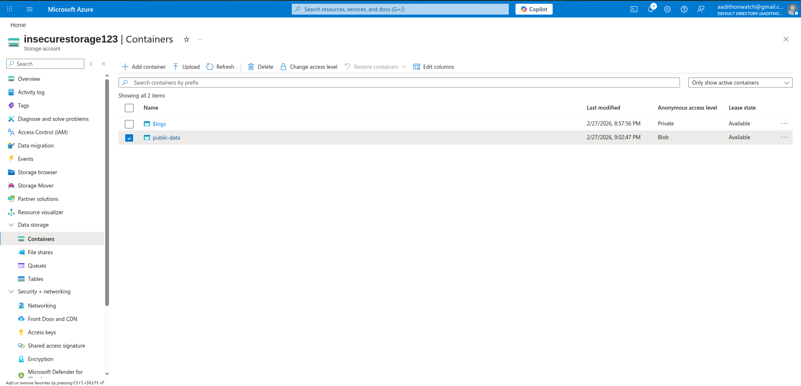

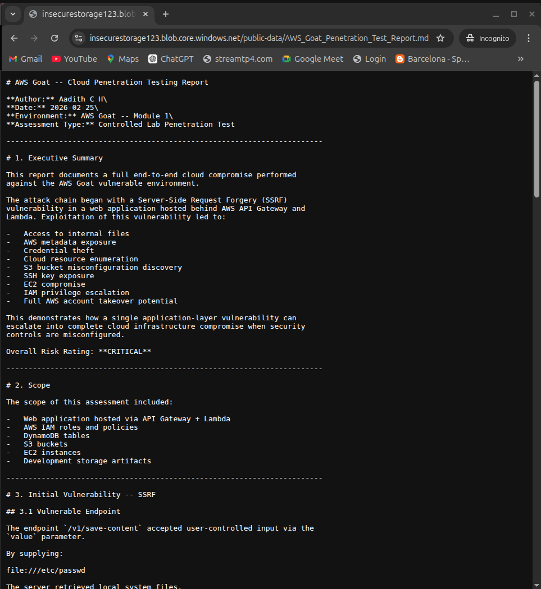

------------------------------------------------------------------------

## 2.3 Virtual Machine Exposure

### Initial State

The virtual machine **myVm** had:

-   Public IP address assigned\
-   Network Security Group allowing SSH (22) from 0.0.0.0/0\
-   No diagnostic logging enabled\
-   No centralized monitoring

### Risk Analysis

Allowing SSH from 0.0.0.0/0 means:

• Any IP address globally can attempt connection\
• Automated bot scanning exposure\
• Brute-force login attempts\
• Credential stuffing attacks\
• Increased attack surface

Public IP exposure also allows:

• Port scanning\
• Direct exploitation attempts\
• Bypass of perimeter controls

### Screenshot Evidence (Before)

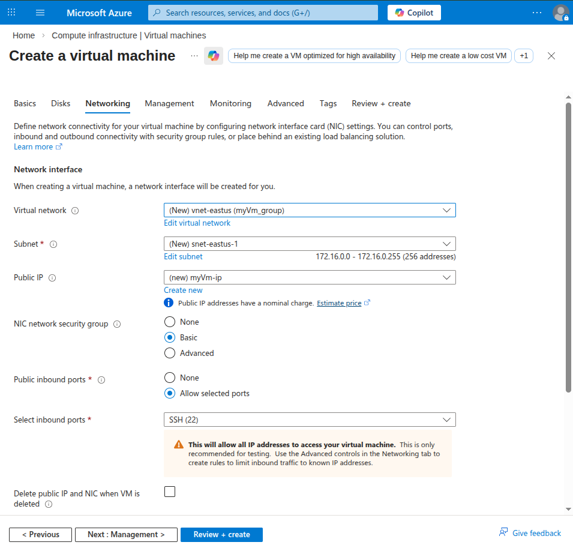

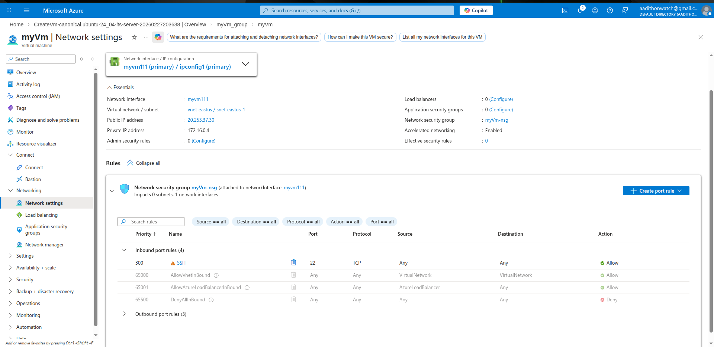

------------------------------------------------------------------------

## 2.4 Monitoring & Governance Gaps

### Initial State

The environment lacked governance enforcement:

-   No Azure Policy assignments\
-   No compliance baseline\
-   No Log Analytics workspace integration\
-   No centralized log collection

### Risk Analysis

Without monitoring and governance:

• Configuration drift goes undetected\
• Security misconfigurations persist\
• No forensic visibility\
• No compliance validation\
• No alerting capability

### Screenshot Evidence (Before)

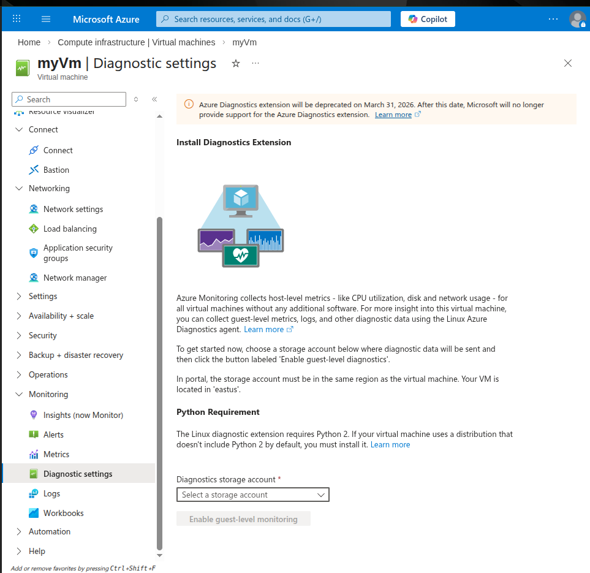

------------------------------------------------------------------------

## 2.5 Application Layer Exposure

### Initial State

Application Gateway Web Application Firewall (WAF) was configured in
**Detection Mode** instead of Prevention Mode.

### Risk Analysis

Detection mode only logs malicious requests but does not block them.

This allows:

• SQL injection attempts to reach backend\
• Cross-site scripting payloads\
• Malicious request patterns\
• Potential exploitation of application vulnerabilities

Without prevention mode:

• Attacks are recorded but not stopped\
• Backend services remain exposed\
• Risk of application compromise remains high

### Screenshot Evidence (Before)

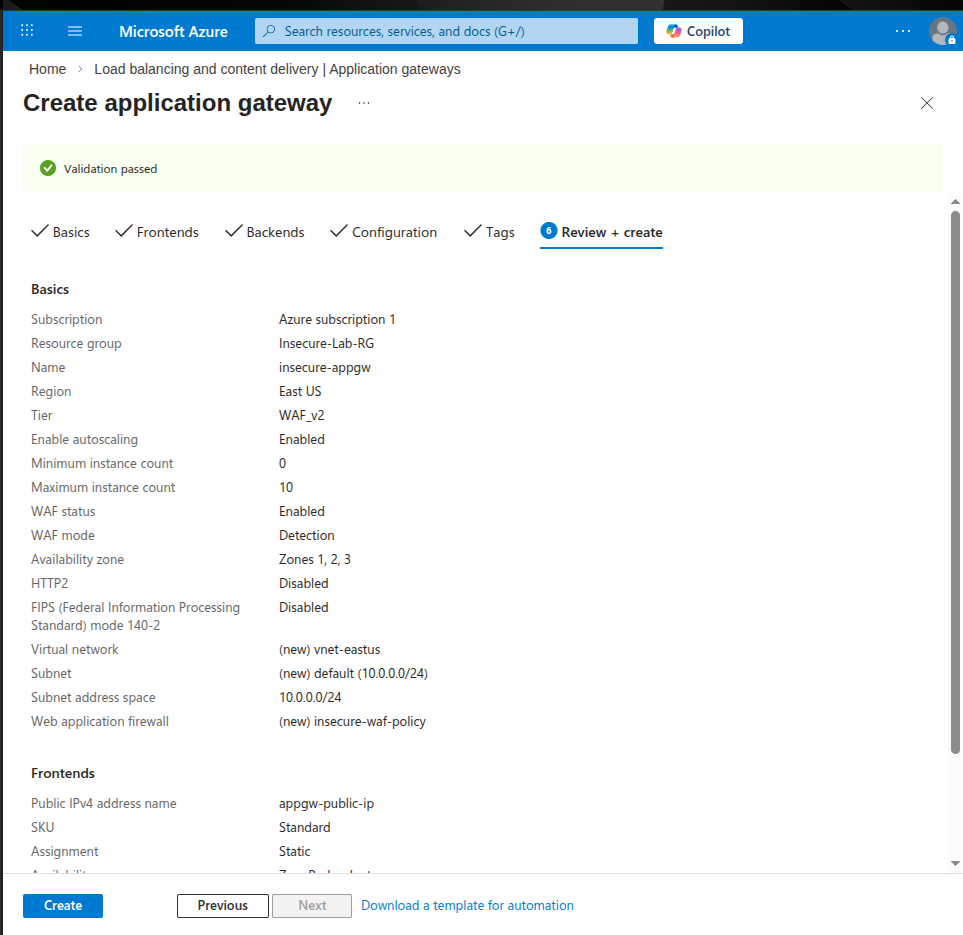

------------------------------------------------------------------------
# 3. Identity Hardening (Microsoft Entra ID)

## 3.1 Enable Multi-Factor Authentication (MFA)

### Objective

Strengthen identity security by enforcing Multi-Factor Authentication
for privileged users to prevent unauthorized access.

### Remediation Steps (Portal)

Microsoft Entra ID → Users → Per-user MFA → Enable MFA\
Configure Microsoft Authenticator or FIDO2 device.

### Screenshot (After)

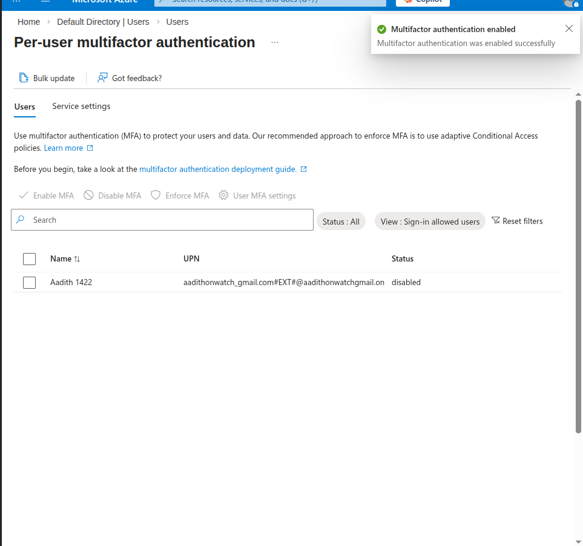

### Security Improvement

✔ Prevents account takeover\
✔ Reduces phishing success rate\
✔ Protects subscription-level access\
✔ Aligns with CIS Azure Benchmark

------------------------------------------------------------------------

# 4. Storage Account Hardening

## 4.1 Disable Blob Anonymous Access

### Remediation Steps

Storage Account → Configuration →\
Set **Allow Blob anonymous access = Disabled**

### Screenshot (After)

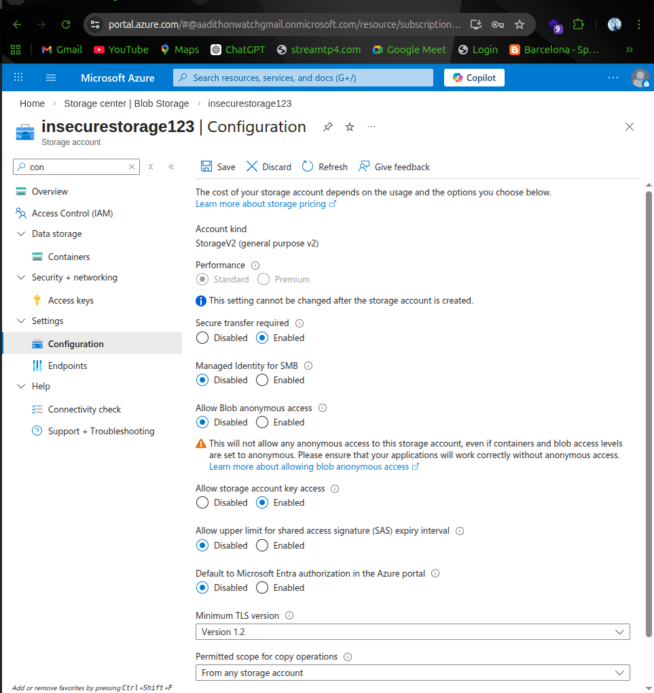

### Security Improvement

✔ Prevents unauthenticated access\
✔ Protects sensitive files\
✔ Enforces identity-based access

------------------------------------------------------------------------

## 4.2 Set Container Access Level to Private

### Remediation Steps

Storage Account → Containers →\
Select container → Change access level → Private

### Screenshot (After)

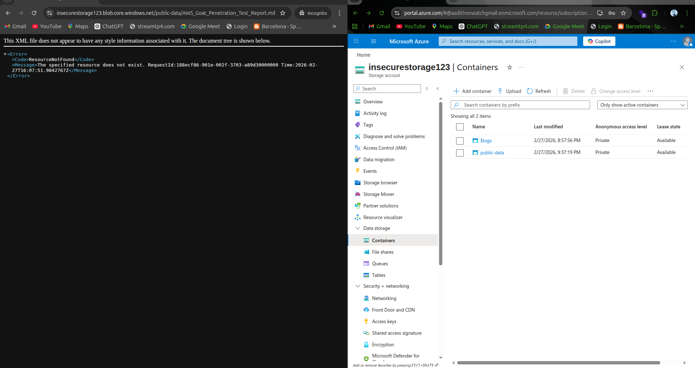

### Security Improvement

✔ Eliminates public exposure\
✔ Blocks direct URL access\
✔ Enforces RBAC controls

------------------------------------------------------------------------

# 5. Virtual Machine Hardening

## 5.1 Restrict SSH Access

### Remediation Steps

Virtual Machine → Networking → Network Security Group →\
Edit Inbound Rules → Remove SSH from 0.0.0.0/0\
Add SSH rule for YOUR_PUBLIC_IP/32

### Screenshot (After)

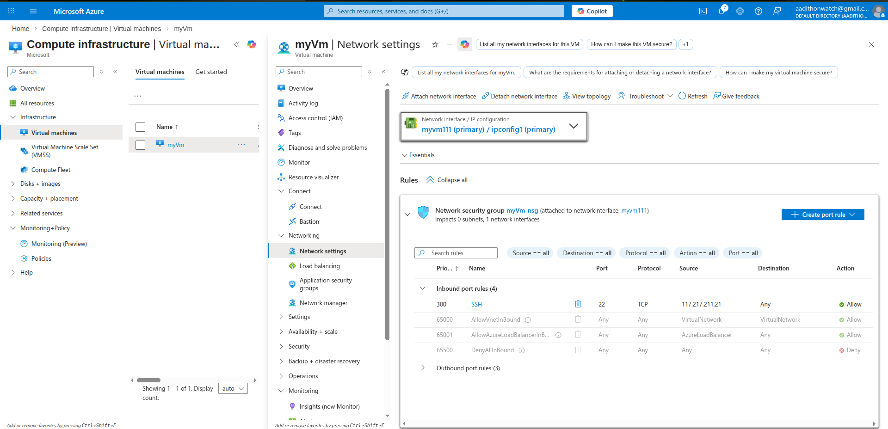

### Security Improvement

✔ Limits SSH to trusted IP\
✔ Reduces brute-force attempts\
✔ Reduces attack surface

------------------------------------------------------------------------

# 6. Monitoring & Logging Hardening

## 6.1 Enable Diagnostic Settings for VM

### Remediation Steps

VM → Monitoring → Diagnostic Settings →\
Enable diagnostics → Send logs to Log Analytics Workspace

### Screenshot (After)

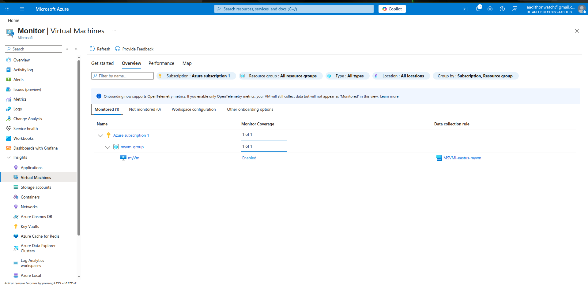

### Security Improvement

✔ Captures performance metrics\
✔ Enables log analysis\
✔ Supports incident response\
✔ Enables alerting

------------------------------------------------------------------------

# 7. Azure Policy Governance

### Remediation Steps

Azure Policy → Assignments →\
Assign built-in policy:\
"Storage accounts should disable public network access"

### Screenshot (After)

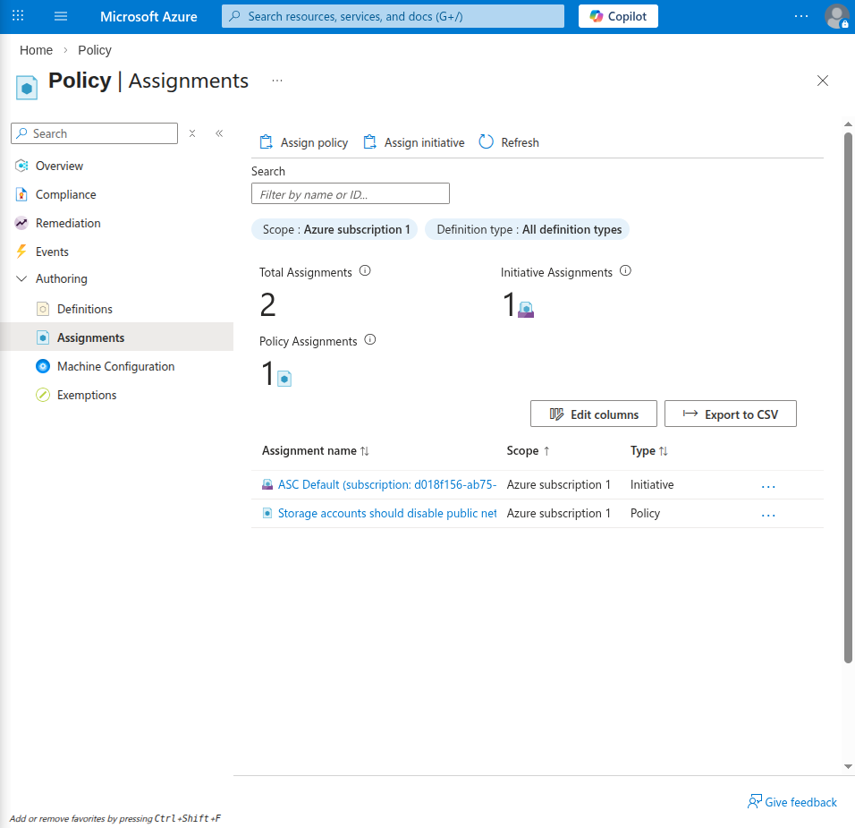

### Security Improvement

✔ Enforces compliance\
✔ Prevents future misconfiguration\
✔ Provides governance baseline

------------------------------------------------------------------------

# 8. Application Gateway & WAF Hardening

## Switch WAF from Detection to Prevention Mode

### Remediation Steps

Application Gateway → Web Application Firewall →\
Change Mode: Detection → Prevention

### Screenshot (Before)

### Screenshot (After)

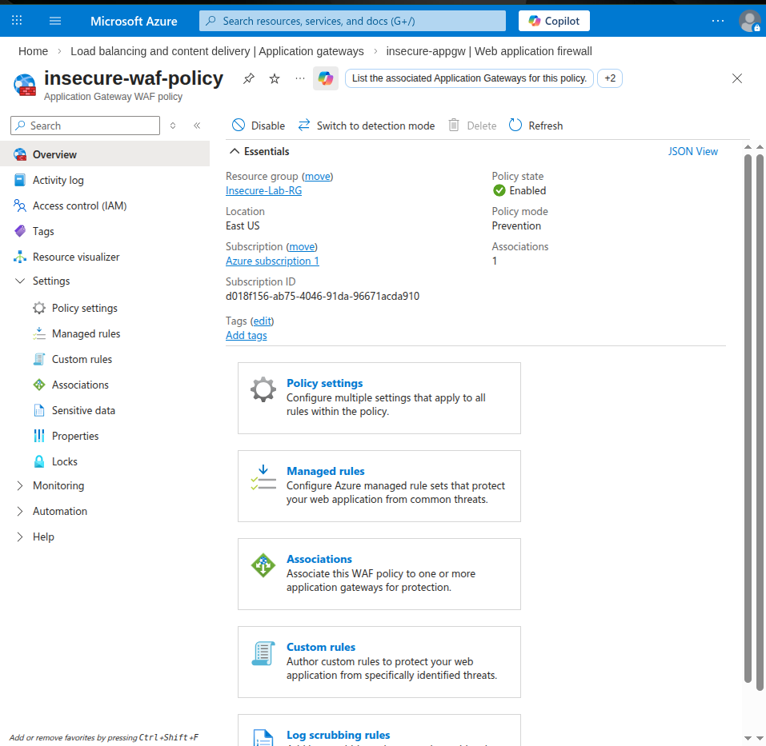

### Security Improvement

✔ Blocks SQL injection\
✔ Blocks XSS payloads\
✔ Enforces OWASP protection\
✔ Stops malicious requests before backend

------------------------------------------------------------------------

# 9. Before vs After Summary

  Component     Before        After
  ------------- ------------- ------------
  MFA           Disabled      Enabled
  Storage       Public        Private
  Container     Public        Private
  SSH           Open to Any   Restricted
  Diagnostics   Disabled      Enabled
  Policy        None          Enforced
  WAF           Detection     Prevention

------------------------------------------------------------------------

# 10. Trade-offs

-   Increased Azure cost (Log Analytics, WAF)
-   Additional policy management
-   More complex governance
-   Requires ongoing monitoring

------------------------------------------------------------------------

# 11. Final Secure Architecture

Internet\
↓\
Application Gateway\
↓\
WAF (Prevention Mode)\
↓\
Private VM\
↓\
Storage (Private + Policy Enforced)\
↓\
Log Analytics Monitoring

------------------------------------------------------------------------

# 12. Security Principles Applied

-   Least Privilege
-   Defense in Depth
-   Zero Trust Network Access
-   Governance Enforcement
-   Secure by Default
-   Continuous Monitoring
-   Reduced Attack Surface

------------------------------------------------------------------------

# 13. Conclusion

The Azure environment was successfully transformed from an insecure,
publicly exposed configuration into an enterprise-grade hardened cloud
architecture.

All critical risks were mitigated:

✔ Identity hardened\
✔ Storage secured\
✔ Network exposure minimized\
✔ Monitoring enabled\
✔ Governance enforced\
✔ Application layer protected

------------------------------------------------------------------------

# END OF REPORT
