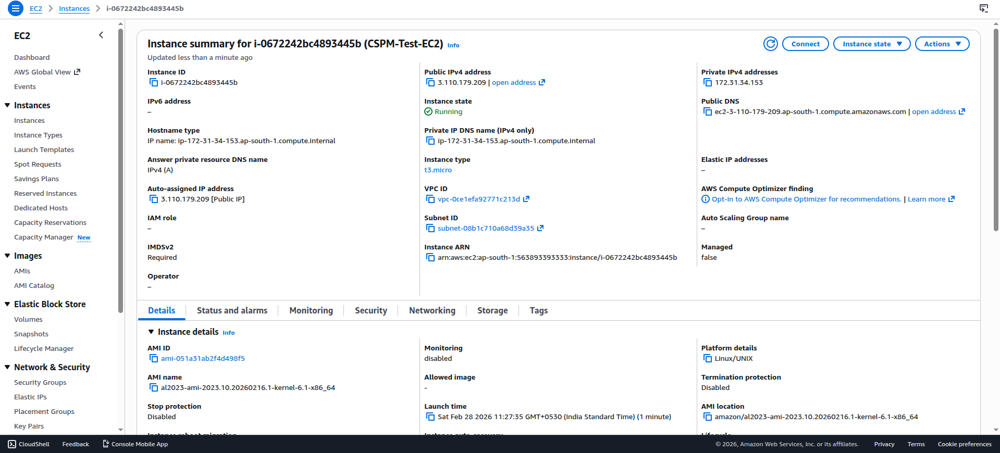
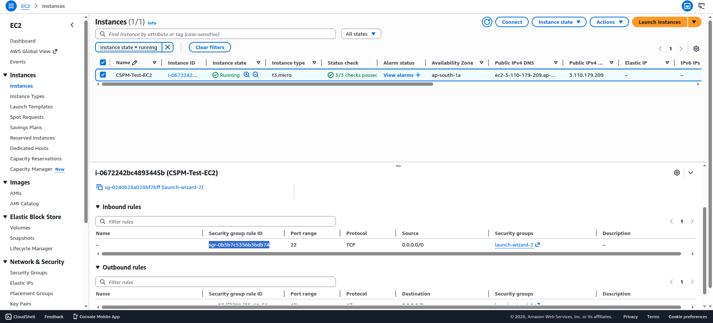
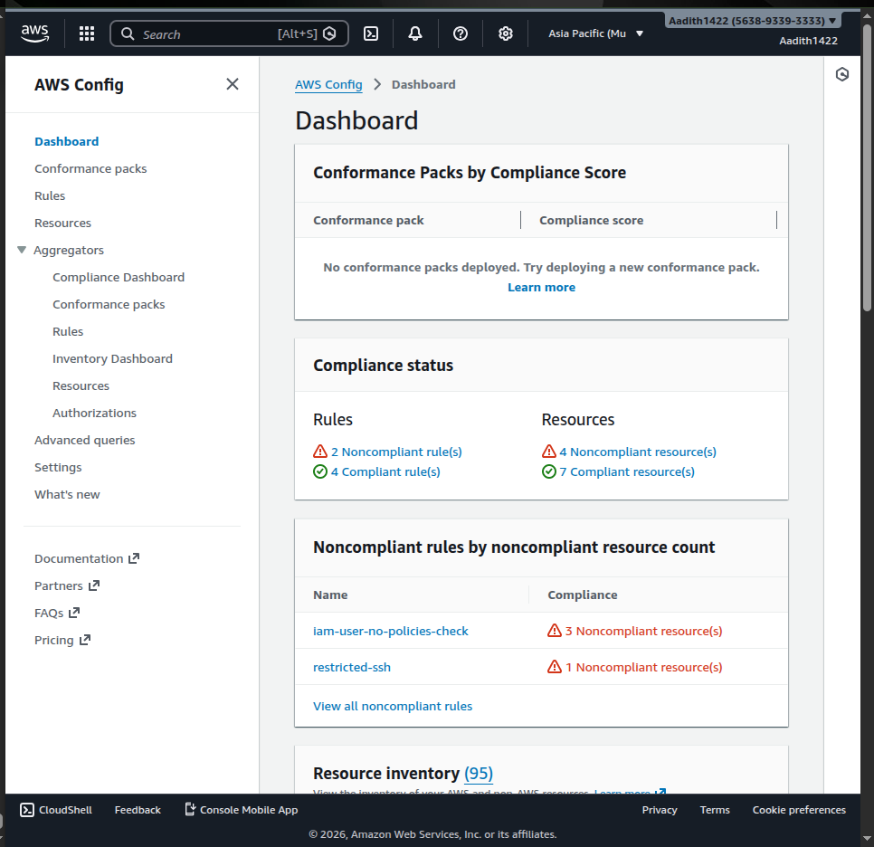
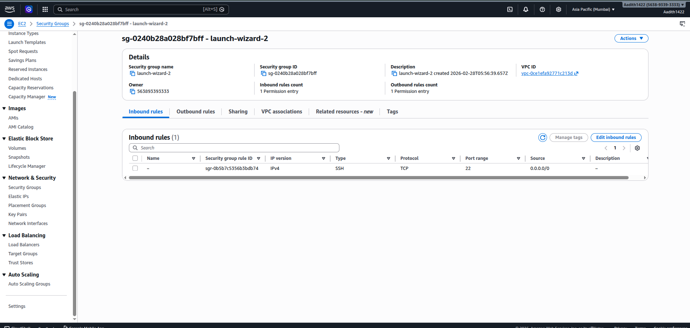
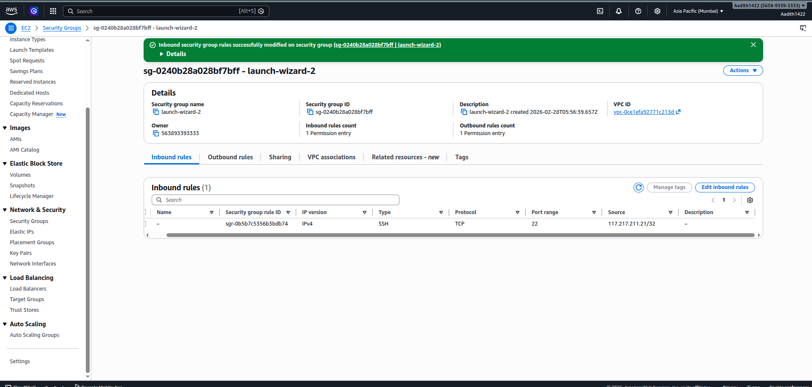
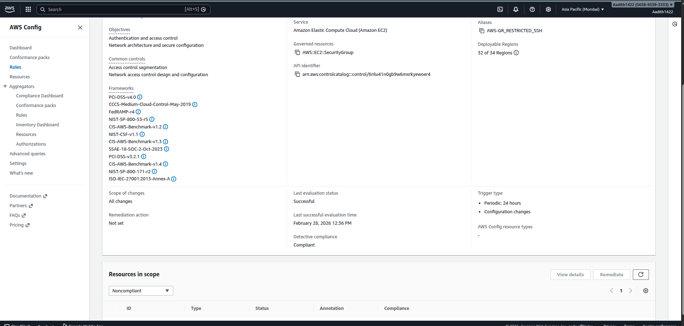
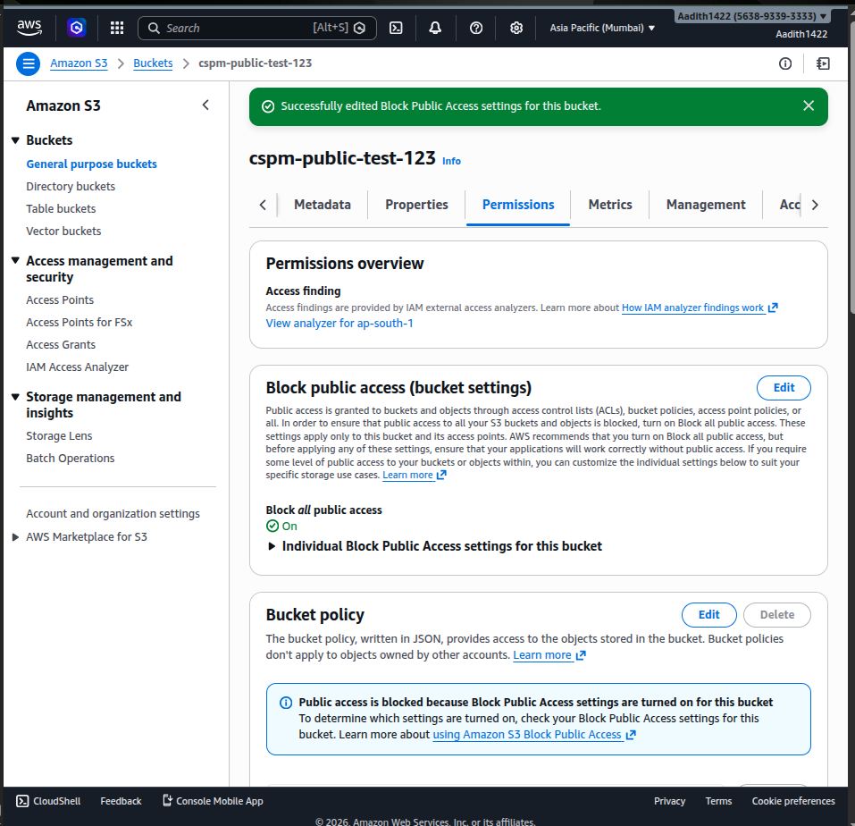

# AWS Cloud Security Posture Assessment Report

**Prepared By:** Aadith C H\
**AWS Account ID:** 5638-9339-3333\
**Region:** ap-south-1 (Mumbai)\
**Date:** 28 February 2026

------------------------------------------------------------------------

## 1. Executive Summary

This report documents a structured Cloud Security Posture Assessment
performed on an AWS lab environment.

AWS Config managed rules were enabled to continuously evaluate resource
configurations. Misconfigurations were intentionally introduced to
simulate real-world cloud risks and then remediated following AWS
security best practices.

------------------------------------------------------------------------

## 2. Environment Setup

### EC2 Instance Running

-   Instance Type: t3.micro\
-   Public IP Assigned\
-   Security Group: launch-wizard-2\
-   Region: ap-south-1

------------------------------------------------------------------------

## 3. Security Findings

### Finding 1: SSH Port Open to the Internet

**Severity:** High\
**Rule Triggered:** restricted-ssh

**Description:**\
Inbound rule allowed TCP port 22 from 0.0.0.0/0.

**Security Risk:**\
- Brute-force attacks\
- Unauthorized remote access\
- Credential compromise\
- Increased attack surface

------------------------------------------------------------------------

### AWS Config Detection -- Restricted SSH Rule

AWS Config flagged the security group as **Noncompliant** under the
`restricted-ssh` managed rule.

------------------------------------------------------------------------

### Finding 2: S3 Block Public Access Disabled

**Severity:** High

**Description:**\
S3 bucket had "Block all public access" disabled.

**Security Risk:**\
- Public data exposure\
- Sensitive file leakage\
- Regulatory non-compliance\
- Reputation damage

------------------------------------------------------------------------

## 4. Remediation Steps (Detailed)

### Remediation 1: Restrict SSH Access

**Step-by-Step Fix:**

1.  Navigate to EC2 → Security Groups.\
2.  Select affected security group (launch-wizard-2).\
3.  Edit inbound rules.\
4.  Locate SSH rule (Port 22).\
5.  Change source from `0.0.0.0/0` to trusted IP address
    `117.217.211.21/32`.\
6.  Save rules.

**Security Improvement:**\
- Enforced least privilege access\
- Reduced external attack surface\
- Prevented unauthorized internet-wide SSH attempts

**Validation:**

AWS Config re-evaluated the rule and marked it **Compliant**.

------------------------------------------------------------------------

### Remediation 2: Enable S3 Block Public Access

**Step-by-Step Fix:**

1.  Navigate to S3 → Buckets.\
2.  Select bucket: `cspm-public-test-123`.\
3.  Go to Permissions tab.\
4.  Click Edit under Block Public Access settings.\
5.  Enable "Block all public access."\
6.  Save changes and confirm.

**Security Improvement:**\
- Prevented accidental public exposure\
- Enforced organization-wide secure storage posture\
- Reduced data leakage risk

**Validation:**\
- Public access fully blocked\
- Bucket secured\
- No public policy allowed

------------------------------------------------------------------------

## 5. Post-Remediation Validation

After applying fixes:

-   AWS Config dashboard showed compliant status.\
-   SSH access limited to trusted IP only.\
-   No publicly accessible S3 bucket.\
-   Root MFA verified as enabled.\
-   No active root access keys.

------------------------------------------------------------------------

## 6. Before vs After Comparison

  Component           Before           After
  ------------------- ---------------- ---------------------------
  SSH Access          0.0.0.0/0        Restricted to specific IP
  S3 Public Access    Block disabled   Block enabled
  AWS Config Status   Noncompliant     Compliant
  Attack Surface      High             Reduced

------------------------------------------------------------------------

## 7. Risk Reduction Summary

-   Eliminated internet-wide SSH exposure\
-   Prevented potential data breach via S3\
-   Improved compliance posture\
-   Implemented proactive configuration monitoring\
-   Strengthened defense-in-depth strategy

------------------------------------------------------------------------

## 8. Conclusion

The AWS lab environment now follows cloud security best practices and demonstrates a complete CSPM workflow:

-   Detection\
-   Prioritization\
-   Remediation\
-   Validation\
-   Documentation

------------------------------------------------------------------------

**End of Report**